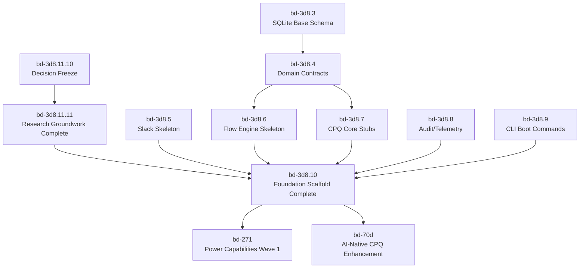

# RCH-09: Decision Freeze and Phased Execution Plan

**Research Task:** `bd-3d8.11.10`  
**Status:** Complete  
**Date:** 2026-02-23  
**Researcher:** LilacMountain (Codex)  
**Primary Inputs:** `.planning/ARCHITECTURE_DECISION_RESEARCH.md`, `.planning/research/RCH-01-Canonical-Domain-Model-Invariants.md`, `.planning/research/RCH-02-Rules-Architecture-and-Evaluation-Order.md`, `.planning/research/RCH-03-Slack-Command-Grammar-and-Thread-Lifecycle.md`, `.planning/research/RCH-04-Reliability-and-Idempotency-Architecture.md`, `.planning/research/RCH-05-Approval-Governance-and-Delegation-Model.md`, `.planning/research/RCH-06-CRM-Contract-and-Sync-Boundary-Design.md`, `.planning/research/RCH-07-Observability-KPI-and-SLO-Framework.md`, `.planning/research/RCH-05-Security-and-Compliance-Baseline.md`

---

## Executive Summary

This document closes the foundation research loop by freezing architecture defaults, publishing an implementation-sequenced phase plan, and recording explicit deferrals.

Outcomes:

1. ADR index finalized for foundation execution.
2. High-risk unresolved questions are either explicitly resolved here or deferred to tracked beads.
3. P0/P1/P2 execution order is defined with dependency gates and entry criteria.
4. Research gate closure path is unambiguous (`bd-3d8.11.10` -> `bd-3d8.11.11` -> `bd-3d8.10`).

---

## 1. Decision Freeze Scope

Freeze applies to foundation architecture and immediate execution sequencing for:

1. domain model and invariants,
2. deterministic rules and CPQ behavior,
3. Slack ingress/command contracts,
4. reliability/idempotency semantics,
5. approval governance,
6. CRM boundary and sync ownership,
7. observability and security baselines,
8. quality-gate and change-control protocol.

Change-control rule after freeze:

1. Any behavior-altering change to frozen defaults requires ADR supersession note and linked bead update.
2. No silent changes to deterministic contracts (rule order, approval authority, idempotency key semantics, audit correlation schema).

---

## 2. Finalized ADR Index (Foundation Freeze)

## 2.1 Accepted and Active for Foundation

| ADR | Decision | Status (Freeze) | Evidence |
|---|---|---|---|
| ADR-0001 | Workspace and crate topology | Accepted | `.planning/ARCHITECTURE_DECISION_RESEARCH.md`, `bd-3d8.1` completion |
| ADR-0002 | Async runtime and process model | Accepted | `.planning/ARCHITECTURE_DECISION_RESEARCH.md` |
| ADR-0003 | Config layering and secrets | Accepted | `.planning/ARCHITECTURE_DECISION_RESEARCH.md`, `README.md` config contract |
| ADR-0004 | SQLite connection/pragma policy | Accepted | `.planning/ARCHITECTURE_DECISION_RESEARCH.md`, `bd-3d8.3*` scope |
| ADR-0005 | Migration strategy and compatibility | Accepted | `.planning/ARCHITECTURE_DECISION_RESEARCH.md`, `bd-3d8.3*` scope |
| ADR-0006 | Canonical domain model contracts | Accepted (promoted from proposed) | `RCH-01` |
| ADR-0007 | Deterministic flow engine semantics | Accepted (promoted from proposed) | `RCH-01` + `RCH-04` |
| ADR-0008 | Pricing precision and representation | Accepted | `.planning/ARCHITECTURE_DECISION_RESEARCH.md`, `RCH-02` |
| ADR-0009 | Rules and policy eval ordering | Accepted (promoted from proposed) | `RCH-02` |
| ADR-0010 | Slack Socket Mode ingress boundary | Accepted | `.planning/ARCHITECTURE_DECISION_RESEARCH.md`, `ADR-002` |
| ADR-0011 | Slack command grammar and thread lifecycle | Accepted (promoted from proposed) | `RCH-03` |
| ADR-0012 | Idempotency and retry strategy | Accepted (promoted from proposed) | `RCH-04`, `ADR-002` |
| ADR-0013 | Approval governance and delegation | Accepted (promoted from proposed) | `RCH-05` |
| ADR-0014 | CRM adapter boundary via Composio REST | Accepted (promoted from trial) | `RCH-06` |
| ADR-0015 | Observability and trace model | Accepted | `RCH-07` |
| ADR-0016 | Security baseline and secret handling | Accepted | `RCH-08` baseline + `ADR-005` |
| ADR-0017 | CLI and operator contract | Accepted | `.planning/ARCHITECTURE_DECISION_RESEARCH.md` |
| ADR-0018 | Health/readiness semantics | Accepted | `.planning/ARCHITECTURE_DECISION_RESEARCH.md` |
| ADR-0019 | Verification architecture and quality gates | Accepted | `.planning/ARCHITECTURE_DECISION_RESEARCH.md` |
| ADR-0020 | Decision freeze and change-control protocol | Accepted (promoted from proposed) | this artifact (`RCH-09`) |

## 2.2 Supplemental Accepted ADR Artifacts (Parallel Research Track)

| ADR File | Scope |
|---|---|
| `ADR-002-Socket-Mode-Connection-Management.md` | Socket reliability and dual-connection posture |
| `ADR-003-Constraint-Solver.md` | Constraint solver architecture (AC-3 baseline) |
| `ADR-004-LLM-Integration-Architecture.md` | LLM translator + deterministic validator boundary |
| `ADR-005-Security-Baseline-Architecture.md` | Security baseline controls for foundation |
| `ADR-006-CPQ-Security-Compliance-Architecture.md` | Expanded CPQ security/compliance controls |

These do not supersede ADR-0001..0020; they deepen implementation guidance.

---

## 3. High-Risk Question Closure Matrix

| Question | Risk | Freeze Decision | Status |
|---|---|---|---|
| `quote.status` vs `flow_state.current_step` drift (`RCH-01` A1) | High | `quote.status` is external lifecycle phase; `flow_state.current_step` is execution pointer; enforce compatibility validator | Closed |
| Mutable line financials vs immutable snapshot (`RCH-01` A2) | High | line financial columns are current computed view only; immutable pricing snapshot is audit truth | Closed |
| Re-approval invalidation after quote edits (`RCH-01` A3) | High | material-change predicate invalidates prior approvals and reroutes | Closed |
| Rule ordering and tie collisions (`RCH-02`) | High | stage + priority + deterministic tie-break is mandatory | Closed |
| Duplicate/replayed ingress side effects (`RCH-04`, `RCH-08`) | High | reserve idempotency key before side effects; dedupe mutation commands | Closed |
| Unauthorized/stale approval actions (`RCH-05`, `RCH-08`) | High | actor authz + quote-version binding + stale action rejection | Closed |

No unresolved high-risk questions remain unclassified.

---

## 4. Explicit Deferrals and Backlog Mapping

The following items are consciously deferred as follow-on implementation/research hardening, with explicit beads:

| Deferred Item | Bead | Why Deferred | Phase |
|---|---|---|---|
| Rule schema alternatives and replay benchmark | `bd-3d8.11.3.1` | Needs concrete schema + benchmark harness after baseline crates settle | P1 |
| Block Kit pattern library and message state map | `bd-3d8.11.4.1` | Depends on stable Slack router/handler seams | P1 |
| Deterministic failure injection matrix | `bd-3d8.11.5.1` | Requires runnable adapter and flow seams | P1 |
| Approval edge-case workbook/playbook | `bd-3d8.11.6.1` | Needs finalized authority fixtures | P1 |
| CRM field mapping/conflict matrix | `bd-3d8.11.7.1` | Needs provider DTO snapshots and adapter contracts | P1 |
| Event taxonomy and dashboard blueprint formalization | `bd-3d8.11.8.1` | Best finalized against actual emitted events | P1 |
| Threat worksheet and control verification mapping | `bd-3d8.11.9.1` | Requires test/control evidence once security hooks land | P1 |

Additional medium-risk assumptions carried into implementation:

1. timezone normalization and date-only semantics (captured in `RCH-01`, implemented under domain/flow tasks),
2. advanced `/quote list` search syntax (deferred; minimal deterministic filters only in initial Slack contract),
3. expanded CRM conflict policies beyond MVP field set (deferred to `bd-3d8.11.7.1` and adapter tasks).

---

## 5. Phased Execution Plan (P0/P1/P2)

## 5.1 P0: Foundation Completion and Gate Readiness

Objective: complete the deterministic scaffold and close hard gates that unblock all feature waves.

Primary beads:

1. Research closure: `bd-3d8.11.10` (this task), `bd-3d8.11.11`.
2. Foundation implementation spine: `bd-3d8.2`, `bd-3d8.3`, `bd-3d8.4`, `bd-3d8.5`, `bd-3d8.6`, `bd-3d8.7`, `bd-3d8.8`, `bd-3d8.9`.
3. Foundation verification and gate checks: `bd-3d8.10.1`, `bd-3d8.10.2`, `bd-3d8.10.3`, `bd-3d8.10.4`, then `bd-3d8.10`.

Exit criteria:

1. research gate closed (`bd-3d8.11.11`),
2. foundation gate closed (`bd-3d8.10`),
3. quality-gate matrix green,
4. handoff notes published for downstream feature teams.

## 5.2 P1: Hardening and Decision-Depth Follow-Ons

Objective: convert deferred research subtasks into implementation-ready artifacts and fixtures.

Primary beads:

1. `bd-3d8.11.3.1`
2. `bd-3d8.11.4.1`
3. `bd-3d8.11.5.1`
4. `bd-3d8.11.6.1`
5. `bd-3d8.11.7.1`
6. `bd-3d8.11.8.1`
7. `bd-3d8.11.9.1`

Exit criteria:

1. deferred research debt reduced to implementation-level checklists and fixtures,
2. risk controls mapped to tests/telemetry queries,
3. no ambiguous contract edges in Slack/Rules/Approval/CRM/Security seams.

## 5.3 P2: Post-Foundation Feature Waves

Objective: start differentiated capability delivery after gates are closed.

Primary epics (already blocked by foundation gate):

1. `bd-271` (Power Capabilities Wave 1),
2. `bd-70d` (AI-Native CPQ Enhancement Initiative).

Entry criteria:

1. `bd-3d8.10` closed,
2. deterministic and audit invariants proven in scaffold,
3. owners assigned for each feature track with explicit dependency-aware sequencing.

---

## 6. Dependency Graph (Execution-Critical)

---

## 7. Post-Foundation Entry Criteria (Unambiguous)

No non-foundation feature bead starts until all are true:

1. `bd-3d8.11.11` is closed,
2. `bd-3d8.10` is closed,
3. migration reversibility and quality gate automation are passing,
4. deterministic audit + correlation fields are present for core quote flows,
5. approval and idempotency invariants are enforceable in code, not only docs.

---

## 8. Multi-Agent Coordination Contract After Freeze

1. Claim beads before edits and announce ownership via Agent Mail thread.
2. Reserve narrow file paths for in-progress edits.
3. Use `bv --robot-next` or `bv --robot-triage` when selecting next work item.
4. Keep `.beads/` state synced with code changes in the same delivery slice.
5. Avoid cross-agent overlap by posting completion + artifact paths immediately upon closure.

---

## 9. Acceptance Mapping for `bd-3d8.11.10`

Deliverable: Finalized ADR index with accepted decisions  
Completed: Section 2.

Deliverable: Phase plan (P0/P1/P2) and dependency graph  
Completed: Sections 5 and 6.

Deliverable: Risks/debt backlog with explicit deferrals  
Completed: Sections 3 and 4.

Acceptance: unresolved high-risk questions closed or deferred  
Completed: Section 3 (closed) and Section 4 (deferred with beads).

Acceptance: plan executable by multiple agents without ambiguity  
Completed: Sections 5, 6, 7, and 8.

Acceptance: post-foundation entry criteria defined  
Completed: Section 7.
