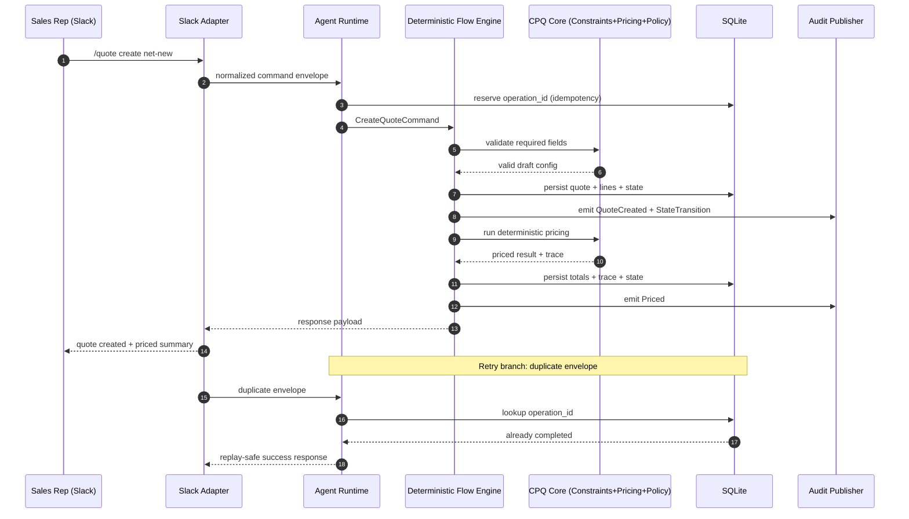
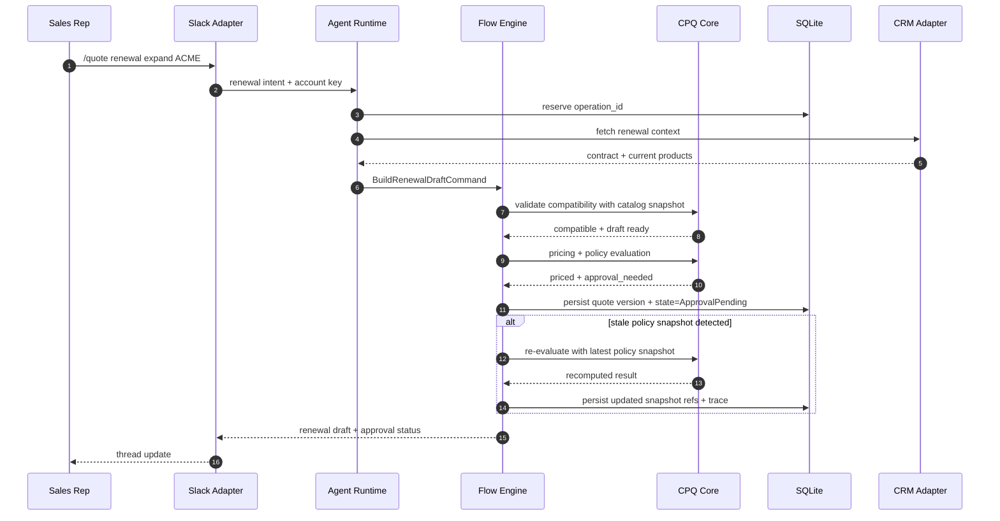
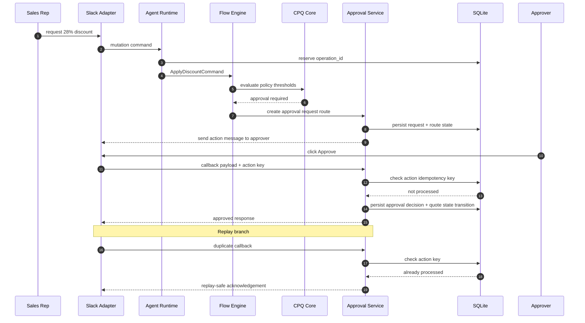

# RCH-01 (Foundation): Canonical Domain Model and Invariants

**Bead:** `bd-3d8.11.2`  
**Related subtask:** `bd-3d8.11.2.1` (sequence diagrams and boundary examples)  
**Date:** 2026-02-23  
**Author:** IvoryBear (Codex)

---

## 1. Objective and Scope

This document defines the canonical domain model for Quotey foundation and the non-negotiable invariants required for deterministic CPQ behavior in Slack.

Deliverables covered:
- Entity map and lifecycle transitions.
- Must-always-hold invariant catalog.
- Data ownership and mutation authority by entity.
- Contract boundaries between domain and adapters.
- Scenario-driven sequence diagrams (net-new, renewal, discount exception), including failure/retry branches.
- Ambiguities and explicit resolution recommendations.
- Implementation handoff notes mapped to foundation beads.

This artifact is normative for foundation implementation unless superseded by an accepted ADR.

---

## 2. Domain Principles (Canonical)

1. **Deterministic authority is in core domain + policy/rules DB, never in LLM output.**
2. **Every state mutation is represented by an operation and leaves an audit trail.**
3. **Prices are deterministic decimals with explicit rounding policy.**
4. **Approval routing is policy-driven and replayable.**
5. **Slack interactions are intent/input channels, not business-authority channels.**
6. **External adapters (CRM/LLM/Doc) are anti-corruption boundaries around core domain.**

---

## 3. Canonical Entity Map

## 3.1 Aggregate Roots

1. **Quote**
- Purpose: authoritative CPQ container for a deal iteration.
- Owns: lifecycle state, line items, totals snapshot, policy snapshot references, approval status, audit correlation IDs.
- Key identifiers: `quote_id`, `quote_version`, `thread_id`, `account_id`, `currency_code`.

2. **ApprovalRequest**
- Purpose: deterministic representation of an approval workflow for a quote snapshot.
- Owns: route state, required approvers, escalation state, per-actor decision artifacts.
- Key identifiers: `approval_request_id`, `quote_id`, `policy_snapshot_id`.

3. **RuleSetSnapshot**
- Purpose: immutable reference set for rules/policies used during an operation.
- Owns: stage-ordered rules, conflict strategy declarations, activation boundaries.
- Key identifiers: `ruleset_snapshot_id`, `source_version`.

4. **ProductCatalogSnapshot**
- Purpose: immutable product/constraint reference set used for deterministic validation and pricing.
- Owns: sellable product revisions, constraints metadata, price book references.
- Key identifiers: `catalog_snapshot_id`, `effective_from`, `effective_to`.

5. **AuditStream (logical aggregate)**
- Purpose: immutable event lineage for operational and business reconstruction.
- Owns: causal event list, operation IDs, actor metadata, before/after hashes.
- Key identifiers: `audit_event_id`, `correlation_id`, `operation_id`.

## 3.2 Core Entities and Value Objects

- `QuoteLine`
- `Money` (Decimal + currency + scale policy)
- `DiscountPolicyDecision`
- `ConstraintViolation`
- `FlowState`
- `IntentProposal` (LLM output wrapper, non-authoritative)
- `OperationKey` (idempotency boundary)
- `PolicyThreshold`
- `ApprovalDecision`
- `PriceTraceStep`

## 3.3 Support Records

- `CustomerContext` (account metadata, optional CRM enrichment)
- `QuoteContext` (working context for deterministic engine)
- `AdapterSyncRecord` (external integration outcomes, never domain authority)

---

## 4. Canonical Lifecycle Model

## 4.1 Quote Lifecycle States

```text
Initialized
  -> GatheringContext
  -> DraftConfigured
  -> Priced
  -> ApprovalPending (conditional)
  -> Approved
  -> Finalized
  -> Expired (terminal)
  -> Rejected (terminal)
```

State semantics:
- `Initialized`: quote shell created with minimum identity metadata.
- `GatheringContext`: required fields being collected/validated.
- `DraftConfigured`: valid configuration candidate exists; pricing not frozen.
- `Priced`: deterministic price computed from explicit snapshots.
- `ApprovalPending`: policy indicates human approval required.
- `Approved`: all required approvals complete for current quote version.
- `Finalized`: quote artifact issued; immutable except amendment/cloning flows.
- `Expired`: lifecycle timeout or explicit expiry action.
- `Rejected`: approval/policy rejection terminal state for this version.

## 4.2 Legal Transition Matrix (Summary)

- `Initialized -> GatheringContext`
- `GatheringContext -> DraftConfigured`
- `DraftConfigured -> Priced`
- `Priced -> DraftConfigured` (on material edit requiring reprice)
- `Priced -> ApprovalPending` (if thresholds breached)
- `Priced -> Approved` (if no approval required)
- `ApprovalPending -> Approved`
- `ApprovalPending -> Rejected`
- `Approved -> Finalized`
- `Any non-terminal -> Expired` (policy/time driven)

Forbidden examples:
- `ApprovalPending -> Finalized` (must pass Approved)
- `Rejected -> Finalized`
- `Expired -> Approved`
- `Finalized -> DraftConfigured` (requires amendment/clone path)

## 4.3 Approval Lifecycle States

```text
Requested -> InReview -> Escalated (optional) -> Approved | Denied | TimedOut
```

---

## 5. Invariant Catalog (Must Always Hold)

## 5.1 Global Invariants

1. `quote_id` is immutable once created.
2. `quote_version` is monotonic and incremented only on accepted state-changing operations.
3. Every accepted state-changing operation emits at least one audit event with `operation_id` and `correlation_id`.
4. Every pricing result references explicit policy/rules/catalog snapshots.
5. No terminal state (`Finalized`, `Rejected`, `Expired`) can be left via in-place mutation.

## 5.2 Quote Invariants

1. A quote always has exactly one account identity.
2. A quote always has one currency context before entering `Priced`.
3. `Finalized` quotes are immutable except explicit amendment/clone flow that creates a new quote/version lineage.
4. Totals are derived values, never manually set bypassing deterministic engine.
5. If any line is materially changed after pricing, quote must return to `DraftConfigured` and lose `Approved` status for that version.

## 5.3 QuoteLine Invariants

1. Each quote line references an active product revision in the active snapshot.
2. Quantity must be > 0 and within product/policy bounds.
3. Line money fields are decimal and currency-consistent with quote header.
4. A line with unresolved hard constraint violations cannot participate in finalized pricing.
5. Bundle child lines must reference valid parent bundle line when `is_bundled=true`.

## 5.4 Pricing Invariants

1. Pricing arithmetic uses Decimal only.
2. Rounding policy is explicit and centrally defined.
3. Price trace step sequence is complete and ordered by stage.
4. Final net total is reproducible from trace steps and inputs.
5. Any policy breach produces explicit decision object and cannot be silently ignored.

## 5.5 Approval Invariants

1. Approval route is resolved from policy snapshot + quote snapshot deterministically.
2. Approval actions are idempotent per action key.
3. `Approved` state requires all mandatory approver conditions satisfied for the active route.
4. `Denied` blocks finalization for the current version.
5. Escalation events preserve original request lineage.

## 5.6 Audit/Observability Invariants

1. Correlation ID remains stable from Slack ingress through final mutation for an operation.
2. Every external side-effect operation logs outcome with deterministic operation key.
3. No secret/token values are emitted in domain or adapter logs.
4. Audit stream is append-only for business events (corrections as new events).

## 5.7 Adapter Boundary Invariants

1. LLM output never directly mutates domain state without deterministic validator acceptance.
2. CRM/Composio payloads are mapped through anti-corruption DTOs; vendor types do not cross into core domain.
3. External adapter failures cannot silently succeed; they return explicit error categories.

---

## 6. Data Ownership and Mutation Authority

| Entity | System of Record | Allowed Mutators | Forbidden Mutators | Notes |
|---|---|---|---|---|
| Quote header/state | SQLite domain tables | Flow engine + domain service layer | Slack adapter, LLM adapter, direct UI payload writes | Slack only requests intents |
| Quote lines | SQLite domain tables | Configuration/pricing services | Raw adapter writes | Must pass constraint and quantity checks |
| Pricing totals/trace | Deterministic pricing engine outputs persisted to SQLite | Pricing engine only | LLM output, manual override without policy path | Overrides require explicit policy flow |
| Approval route/state | Policy engine + approval service persisted in SQLite | Approval service | Slack callback handler directly | Callback must call service with idempotency key |
| Rule/policy definitions | SQLite rules tables (admin-managed) | CLI/admin tooling with validation | Slack chat free-form edits | Runtime read-only in quote operations |
| Product catalog snapshots | SQLite catalog tables + import tooling | Catalog bootstrap/admin tooling | Runtime quote mutation path | Quote uses snapshot refs |
| Audit events | SQLite append-only audit tables | Audit publisher in service layer | Adapters directly | Adapters emit through service-owned hooks |
| External CRM sync records | SQLite integration records | Integration service | Domain aggregates directly | Non-authoritative enrichments |

---

## 7. Domain to Adapter Contract Boundaries

## 7.1 Inbound Boundary (Slack, LLM)

- Accepts: command/event payloads and intent proposals.
- Produces: `DomainCommand` only after validation + idempotency guard.
- Rejects: raw payload-driven direct state writes.

## 7.2 Outbound Boundary (CRM, PDF, Notifications)

- Domain emits effect plan with typed commands.
- Adapter executes side-effect and returns typed result/failure.
- Domain records result in audit/integration records.

## 7.3 Boundary Rule Summary

1. Domain core has no dependency on vendor SDK types.
2. Adapter errors map to normalized domain error taxonomy.
3. Adapter retry policy is bounded and observable.

---

## 8. Scenario Sequence Diagrams with Failure/Retry Branches

## 8.1 Net-New Quote (Happy + Retry Branch)



Ownership map:
- Slack adapter: ingress normalization only.
- Agent runtime: idempotency reservation + orchestration.
- Flow engine: legal transitions.
- CPQ core: deterministic validation/pricing.
- DB: persistence as SoR.
- Audit: append-only event emission.

## 8.2 Renewal Expansion (with stale snapshot branch)



Failure/retry branches:
- CRM timeout -> bounded retry, then explicit degraded mode response (manual context request).
- Duplicate Slack event -> idempotency replay.

## 8.3 Discount Exception Approval (with action replay branch)



---

## 9. Ambiguities and Resolution Recommendations

## 9.1 Quote Versioning Granularity

Ambiguity:
- Should every accepted field mutation increment `quote_version`, or only material financial/policy-impacting changes?

Recommendation:
- Increment on any mutation that changes persisted domain state.
- Maintain a derived `financial_revision` for user-facing diff clarity.

Rationale:
- Simpler determinism/audit semantics while still supporting UX clarity.

## 9.2 Policy Snapshot Pinning

Ambiguity:
- Should a quote remain pinned to old policy snapshot once priced, or force reprice on policy update?

Recommendation:
- Pin snapshot per quote version; require explicit `RepriceWithLatestPolicy` operation before finalization if policy changed.

Rationale:
- Preserves replay and legal explainability.

## 9.3 Renewal Context Source of Truth

Ambiguity:
- Should renewal baseline data primarily come from CRM adapter or local historical quote data?

Recommendation:
- Local persisted quote data is primary for deterministic operations; CRM enriches missing context only.

Rationale:
- Local-first reliability and deterministic replay.

## 9.4 Manual Override Semantics

Ambiguity:
- How to support rare manual pricing adjustments without violating deterministic model?

Recommendation:
- Overrides must be explicit domain operations with policy/approval gates and dedicated audit event types.

Rationale:
- Maintains deterministic authority with governed exceptions.

## 9.5 Constraint Conflict Explainability Depth

Ambiguity:
- Should engine return first failing constraint or full set of violations?

Recommendation:
- Return full set for operator diagnostics; produce concise prioritized subset for Slack response.

Rationale:
- Better debugging without overwhelming end user.

---

## 10. Handoff Notes for Implementation Teams

## 10.1 Immediate implications for foundation beads

1. `bd-3d8.4` (repository/domain trait contracts)
- Implement typed IDs and invariant-safe constructors as baseline.
- Define clear trait boundaries for pricing/policy/approval services.

2. `bd-3d8.5` (Slack skeleton)
- Enforce ack-fast ingress and conversion to typed `DomainCommand`.
- Never mutate domain directly in adapter callbacks.

3. `bd-3d8.3` (SQLite schema/migrations)
- Include tables for quote versions, operation ledger, approval requests, and append-only audit events.
- Ensure schema supports snapshot references (`policy_snapshot_id`, `catalog_snapshot_id`).

4. `bd-3d8.8` (errors/telemetry)
- Standardize error taxonomy around invariant violations, transition illegality, policy breaches, and adapter failures.
- Require `correlation_id` + `operation_id` in critical spans/events.

## 10.2 Suggested module ownership map

- `core/domain/*`: entity invariants, value objects, error types.
- `core/flow/*`: transition matrix and pure transition executor.
- `core/policy/*`: threshold decision contracts.
- `db/repositories/*`: persistence mappings only, no business rules.
- `slack/events/*`: payload normalization and response rendering.
- `agent/runtime/*`: orchestration, idempotency enforcement, effect dispatch.

## 10.3 Validation checklist before accepting implementation PRs

- Are invariants enforced in constructors/mutations, not only handlers?
- Is any adapter type leaking into core domain?
- Can illegal transitions be reproduced and rejected deterministically?
- Are audit events complete for each accepted mutation?
- Do duplicate events/actions remain replay-safe?

---

## 11. Acceptance Criteria Traceability

- **Entity map + lifecycle transitions:** Sections 3 and 4 complete.
- **Invariant list:** Section 5 complete.
- **Contract boundaries:** Section 7 complete.
- **Ambiguities + explicit recommendation:** Section 9 complete.
- **Data ownership + mutation authority:** Section 6 complete.
- **Handoff implementation implications:** Section 10 complete.
- **Scenario-driven sequence diagrams with failure/retry and module ownership:** Section 8 complete.

Result: `bd-3d8.11.2` and `bd-3d8.11.2.1` acceptance criteria are satisfied by this artifact.

