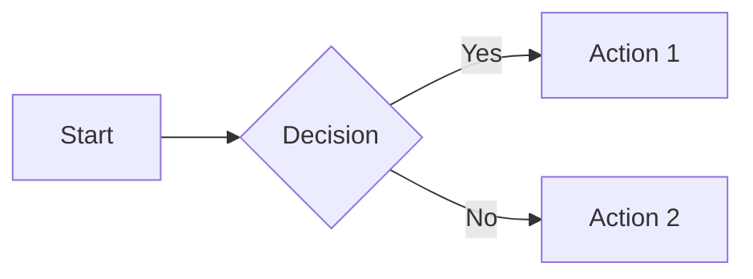

# Quotey Documentation

This is the Docusaurus documentation site for Quotey, an agent-first CPQ (Configure, Price, Quote) system for Slack.

## Development

```bash
# Install dependencies
npm install

# Start development server
npm run start

# Build for production
npm run build

# Serve production build
npm run serve
```

## Structure

```
docs/
├── docs/                    # Documentation content
│   ├── intro/              # Introduction and getting started
│   ├── architecture/       # System architecture
│   ├── core-concepts/      # Core CPQ concepts
│   ├── crates/             # Crate reference
│   ├── guides/             # How-to guides
│   ├── advanced/           # Advanced features
│   ├── api/                # API reference
│   └── contributing/       # Contribution guide
├── src/                    # React components and pages
├── static/                 # Static assets
├── docusaurus.config.ts    # Docusaurus configuration
└── sidebars.ts             # Sidebar configuration
```

## Writing Documentation

### Adding a New Page

1. Create a `.md` or `.mdx` file in the appropriate directory under `docs/`
2. Add front matter:
   ```yaml
   ---
   sidebar_position: 1
   ---
   ```
3. Write content in Markdown

### Code Blocks

Use fenced code blocks with language identifiers:

```rust
pub fn hello() -> &'static str {
    "Hello, Quotey!"
}
```

### Mermaid Diagrams



### Admonitions

```markdown
:::note
This is a note.
:::

:::tip
This is a tip.
:::

:::warning
This is a warning.
:::

:::danger
This is a danger warning.
:::
```

## Deployment

The documentation is automatically deployed when changes are pushed to the main branch.

## Contributing

When adding new features to Quotey:

1. Update relevant documentation in this directory
2. Follow the existing writing style
3. Include code examples where helpful
4. Test locally with `npm run start`
