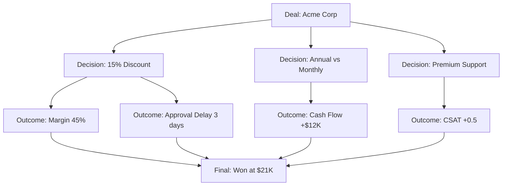

# Autopsy & Revenue Genome

The Revenue Genome is a causal attribution system that analyzes deal outcomes to understand what drives success and failure.

## Overview

Traditional sales analytics tell you *what* happened. The Revenue Genome tells you *why* it happened by:

- Walking backward through the deterministic audit trail
- Attributing outcomes to specific decision forks
- Building a queryable attribution graph
- Enabling counterfactual simulation

## Key Concepts

### Causal Attribution

Unlike correlation-based analytics, the Revenue Genome uses deterministic causation:

```
Correlation: "Deals with discounts >20% have lower win rates"
Causation: "The 25% discount on Q-2026-0042 reduced win probability 
           by 15% because it compressed margin below the competitive 
           threshold for this segment"
```

### Decision Forks

Every quote contains decision points that influence outcomes:

| Fork Type | Example | Impact |
|-----------|---------|--------|
| **Pricing Path** | Volume tier selected | Affects margin |
| **Discount Level** | 10% vs 15% approval | Affects competitiveness |
| **Constraint Resolution** | Which option chosen | Affects product fit |
| **Approval Exception** | VP override granted | Affects timeline |
| **Negotiation Concession** | Counteroffer terms | Affects customer perception |

### Attribution Graph

The system builds a graph of causal relationships:



## Deal Autopsy Process

### Automated Analysis

When a deal closes (won or lost), the system automatically:

1. **Extracts the audit trail** — Every decision from creation to close
2. **Identifies decision forks** — Points where choices affected outcome
3. **Calculates attribution weights** — How much each decision contributed
4. **Compares to precedents** — Similar deals and their outcomes
5. **Generates insights** — Actionable learnings

### Autopsy Report Example

```
Deal Autopsy: Q-2026-0042 (Acme Corp)
======================================

Outcome: Won
Close Date: 2026-02-15
Sales Cycle: 32 days
Final Value: $21,420

Causal Attribution:
───────────────────
Positive Factors (+47% win probability contribution):
  • Product fit score: 9/10 (+18%)
  • Competitive positioning: Beat Vendor X (+15%)
  • Reference customer available: Similar Acme case study (+14%)

Negative Factors (-22% win probability contribution):
  • 15% discount exceeded precedent avg 12% (-12%)
  • Approval delay: 3 days (-6%)
  • No executive sponsor identified (-4%)

Net Win Probability: 75% (actual: Won)

Key Decision Forks:
───────────────────
1. Discount Level (15% vs 10%)
   - Chose: 15% (requested by customer)
   - Counterfactual: 10% would have had 65% win probability
   - Impact: +$1,020 revenue, but +10% win probability
   - Verdict: Correct decision for this competitive situation

2. Billing Frequency (Annual vs Monthly)
   - Chose: Annual with 5% prepay discount
   - Impact: +$12K cash flow, no win probability change
   - Verdict: Good for company, neutral for customer

Recommendations for Similar Deals:
──────────────────────────────────
✓ Lead with 12% discount, escalate to 15% only if competitive threat
✓ Identify executive sponsor in first discovery call
✓ Use Acme case study early in sales cycle
```

## Counterfactual Simulation

The system can answer "what if" questions:

```rust
pub struct CounterfactualEngine;

impl CounterfactualEngine {
    pub fn simulate(
        &self,
        quote: &Quote,
        changes: &[HypotheticalChange],
    ) -> SimulationResult {
        // 1. Clone the quote
        // 2. Apply hypothetical changes
        // 3. Re-run attribution analysis
        // 4. Compare outcomes
        
        SimulationResult {
            original_outcome: /* ... */,
            hypothetical_outcome: /* ... */,
            probability_delta: 0.15,
            value_delta: Decimal::from(-1000),
            confidence: 0.82,
        }
    }
}
```

### Example Simulations

```
What if we had offered 10% instead of 15%?
──────────────────────────────────────────
Original: 15% discount, 75% win probability, $21,420 value
Simulated: 10% discount, 65% win probability, $22,680 value

Expected Value:
  Original: 0.75 × $21,420 = $16,065
  Simulated: 0.65 × $22,680 = $14,742

Verdict: The 15% discount was the better choice (+$1,323 expected value)

Confidence: 82% (based on 12 similar precedent simulations)
```

## Revenue Genome Queries

Query the attribution graph for strategic insights:

### Example Queries

```bash
# What drives wins in the Enterprise segment?
quotey genome query "win factors segment=enterprise"

# How does discount affect renewal rates?
quotey genome query "renewal rate by discount_tier"

# What are the optimal discount levels by deal size?
quotey genome query "optimal_discount by deal_size bucket=4"

# Which constraint violations correlate with losses?
quotey genome query "constraint_violations correlation=outcome"
```

### Query Results

```
Query: win factors segment=enterprise

Results (n=156 deals):
──────────────────────
Top Positive Factors:
  1. Executive sponsor identified: +32% win rate
  2. Custom demo completed: +28% win rate
  3. Reference call conducted: +24% win rate
  4. Pricing within 10% of competitor: +18% win rate

Top Negative Factors:
  1. Discount >20% without approval: -35% win rate
  2. >5 constraint violations: -22% win rate
  3. No technical champion: -19% win rate
  4. Sales cycle >60 days: -15% win rate
```

## Integration with Other Systems

### Closed-Loop Policy Optimizer

The Revenue Genome feeds the Policy Optimizer:

```
Revenue Genome: "15% discounts in SMB have 45% win rate"
                 ↓
Policy Optimizer: Proposes lowering SMB cap to 12%
                  ↓
Deterministic Replay: Validates no negative impact on other segments
                     ↓
Human Approval: Sales leadership reviews and approves
                ↓
Policy Updated: New 12% cap deployed
```

### Negotiation Autopilot

Real-time suggestions during negotiation:

```
Customer: "We need 20% to sign this week"

Negotiation Autopilot Analysis:
───────────────────────────────
Counterfactual: 20% discount
  - Win probability: 85%
  - Margin: 38% (below 60% floor)
  - Policy: Requires CFO approval

Alternative: 15% discount + Q1 start
  - Win probability: 80%
  - Margin: 48% (requires VP approval)
  - Policy: Within escalation threshold

Recommended: 15% + accelerated onboarding
  - Win probability: 82%
  - Margin: 51% (with onboarding fees)
  - Policy: Auto-approvable

[Send Counteroffer] [Request CFO Approval] [Accept 20%]
```

## Database Schema

```sql
-- Causal attribution entries
CREATE TABLE deal_autopsy (
    id TEXT PRIMARY KEY,
    quote_id TEXT NOT NULL REFERENCES quote(id),
    outcome TEXT NOT NULL,  -- won, lost, cancelled
    closed_at TEXT NOT NULL,
    attribution_json TEXT NOT NULL,  -- Weighted factors
    decision_forks_json TEXT,        -- Key decision points
    confidence_score REAL,
    created_at TEXT NOT NULL
);

-- Counterfactual simulations
CREATE TABLE counterfactual_simulation (
    id TEXT PRIMARY KEY,
    quote_id TEXT NOT NULL REFERENCES quote(id),
    hypothetical_changes_json TEXT,
    simulated_outcome_json TEXT,
    probability_delta REAL,
    value_delta DECIMAL,
    confidence REAL,
    created_at TEXT NOT NULL
);

-- Attribution graph edges
CREATE TABLE attribution_edge (
    id TEXT PRIMARY KEY,
    source_node_id TEXT NOT NULL,
    target_node_id TEXT NOT NULL,
    edge_type TEXT NOT NULL,
    weight REAL NOT NULL,
    evidence_json TEXT
);
```

## Privacy Considerations

The Revenue Genome handles sensitive deal data:

- **Data anonymization** — Customer names replaced with hashes in ML features
- **Access control** — Genome queries respect user permissions
- **Retention policies** — Old autopsy data archived per policy
- **Export controls** — Genome data export requires approval

## Configuration

```toml
[features.revenue_genome]
enabled = true
autopsy_enabled = true
counterfactual_enabled = true
min_confidence_threshold = 0.70
retention_days = 2555  # 7 years
```

## See Also

- [Deal DNA](./deal-dna) — Similarity detection for deals
- [Policy Optimizer](./policy-optimizer) — Automated policy improvement
- [Audit Trail](../core-concepts/audit-trail) — The data source for autopsy
