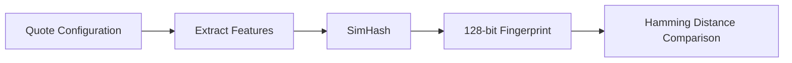

# Deal DNA

Deal DNA is a configuration fingerprinting system that enables similarity detection, precedent analysis, and intelligent suggestions.

## Overview

Every quote configuration generates a **DNA fingerprint** — a compact, comparable signature that captures the essential characteristics of a deal. This enables:

- **Similarity Detection** — Find similar past deals
- **Precedent Analysis** — Learn from historical outcomes
- **Anomaly Detection** — Identify unusual configurations
- **Win Probability** — Score deals based on similar past wins/losses

## How It Works

### Fingerprint Generation



When a quote is priced, the system:

1. Extracts features from the quote (products, quantities, segment, etc.)
2. Generates a **SimHash** — a locality-sensitive hash
3. Stores the 128-bit fingerprint in the database

### Feature Extraction

```rust
pub struct DealFeatures {
    // Product mix (hashed)
    pub product_signature: u64,
    
    // Quantity distribution
    pub total_quantity: u32,
    pub quantity_variance: f64,
    
    // Pricing characteristics
    pub total_value: Decimal,
    pub discount_pct: Decimal,
    
    // Context
    pub segment: Segment,
    pub region: Region,
    pub deal_type: DealType,
    
    // Temporal
    pub month_of_year: u8,
    pub day_of_week: u8,
}
```

### SimHash Algorithm

SimHash is a locality-sensitive hashing algorithm:
- Similar inputs → Similar hashes (small Hamming distance)
- Dissimilar inputs → Random hashes (large Hamming distance)

## Similarity Scoring

Compare two deals using Hamming distance:

| Hamming Distance | Similarity | Interpretation |
|-----------------|------------|----------------|
| 0-10 | >92% | Very similar deals |
| 11-30 | 77-92% | Similar configuration |
| 31-50 | 61-77% | Some overlap |
| 51-100 | 22-61% | Dissimilar |
| >100 | <22% | Completely different |

## Usage in Quotes

When creating a quote, the system automatically:

1. Generates a fingerprint
2. Finds similar historical deals
3. Provides precedent analysis

```
User: /quote new for Acme, Pro Plan 100 seats

Quotey: Creating quote Q-2026-0042...

📊 Precedent Analysis
Found 8 similar deals (avg 87% similarity)
Historical win rate: 75%

⚠️ Recommendation: Similar deals closed with 10-12% discount.
Your default pricing is competitive.

[Continue] [View Similar Deals]
```

## Configuration

```toml
[features.deal_dna]
enabled = true
similarity_threshold = 0.80
max_precedents = 20
```

## See Also

- [Autopsy & Revenue Genome](./autopsy-revenue-genome) — Deep deal analysis
- [Policy Optimizer](./policy-optimizer) — Optimize from precedents
