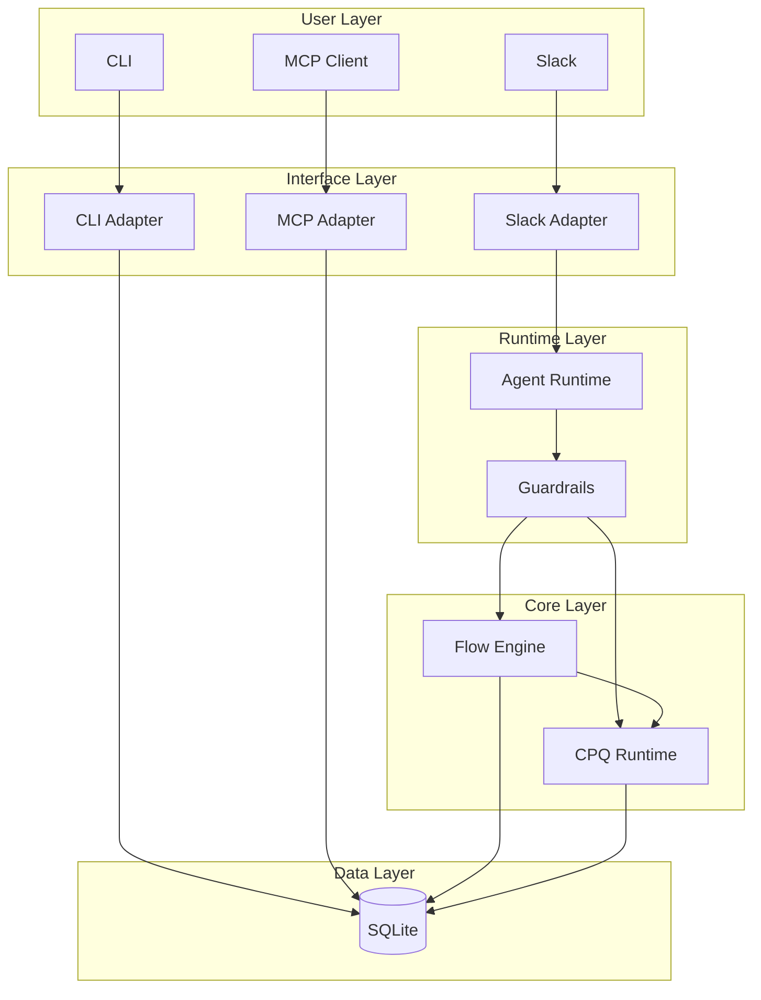
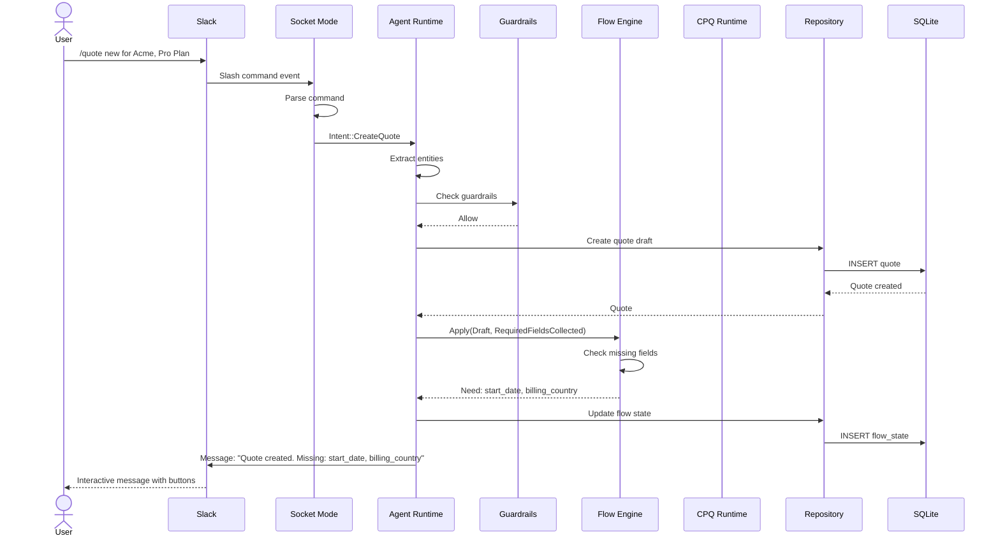
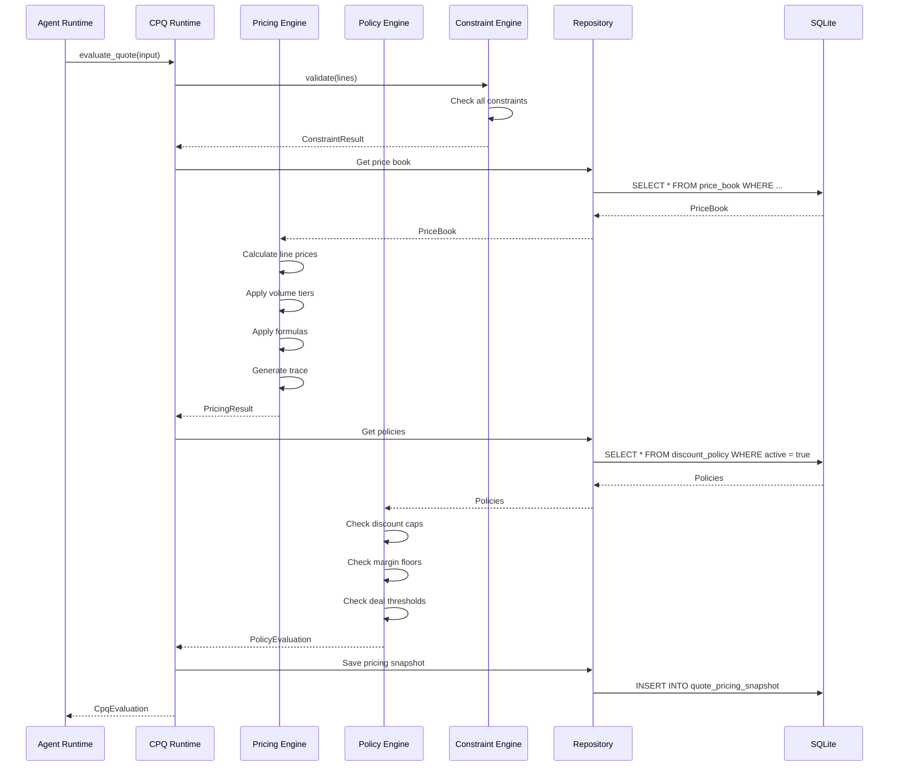
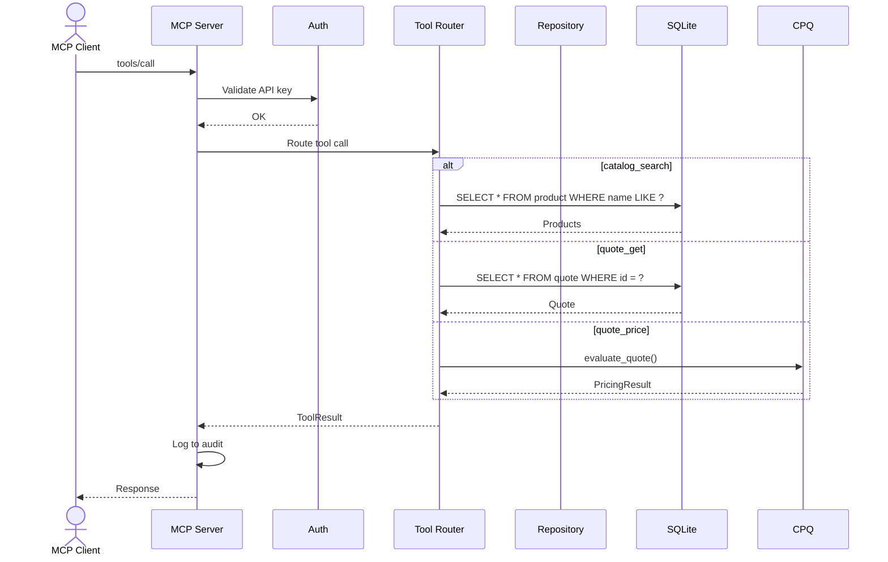
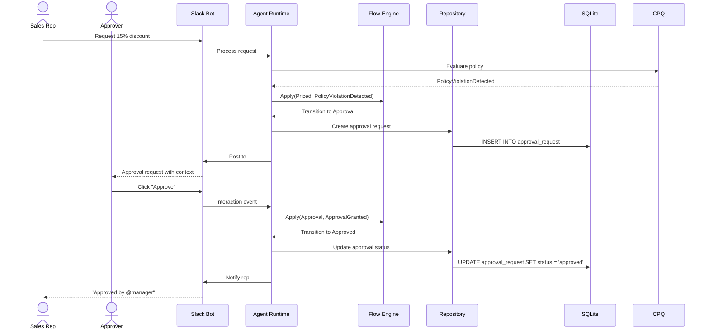
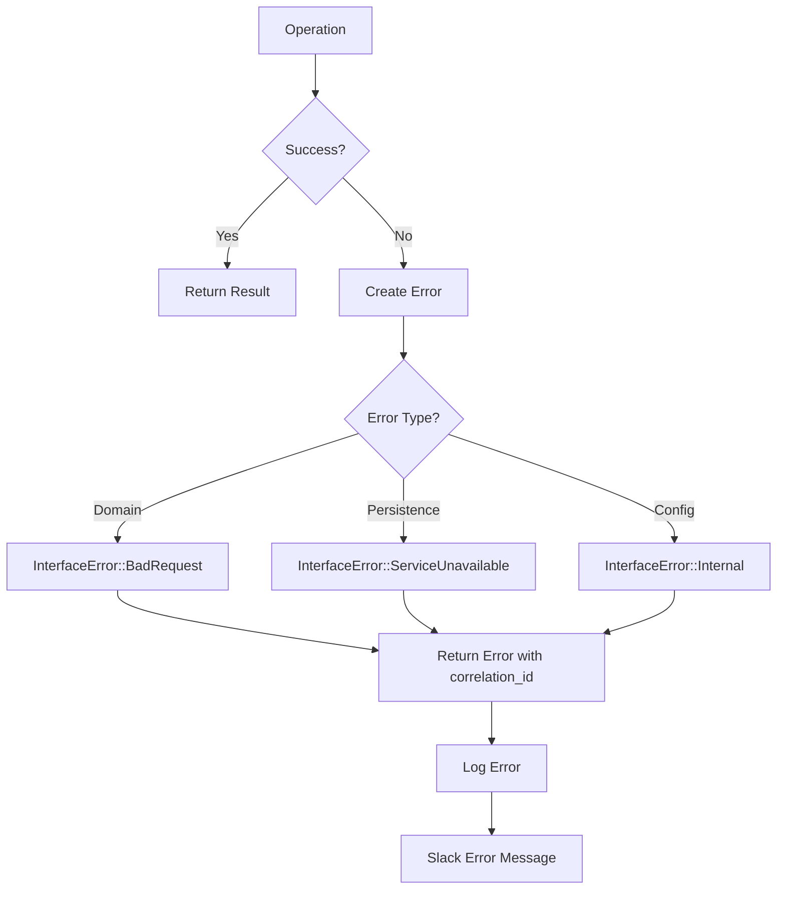

# Data Flow

This document describes how data flows through the Quotey system in various scenarios.

## Request Flow Overview



## Scenario 1: Creating a New Quote (Slack)

### Step-by-Step Flow



### Data Transformations

1. **Slack Event → Domain Intent**
   ```
   {
     "command": "/quote",
     "text": "new for Acme, Pro Plan",
     "user_id": "U123",
     "channel_id": "C456"
   }
   ↓
   Intent::CreateQuote {
     account_hint: "Acme",
     product_hints: ["Pro Plan"],
     context: Context { user: U123, channel: C456 }
   }
   ```

2. **Intent → Quote Entity**
   ```
   Intent::CreateQuote { ... }
   ↓ (with account lookup, product matching)
   Quote {
     id: "Q-2026-0042",
     account_id: "acct_123",
     status: Draft,
     lines: [QuoteLine { product_id: "plan_pro", ... }],
     ...
   }
   ```

3. **Quote → Database Row**
   ```rust
   sqlx::query(
       "INSERT INTO quote (id, account_id, status, ...)
        VALUES (?, ?, ?, ...)"
   )
   .bind(&quote.id.0)
   .bind(quote.account_id.as_ref().map(|a| &a.0))
   .bind(&quote.status.to_string())
   // ...
   ```

## Scenario 2: Pricing a Quote



## Scenario 3: MCP Tool Call



## Scenario 4: Approval Workflow



## Data Persistence Patterns

### Write-Through Cache Pattern

```rust
// Repository implements caching with write-through
pub struct CachingQuoteRepository {
    inner: Box<dyn QuoteRepository>,
    cache: Arc<RwLock<HashMap<QuoteId, Quote>>>,
}

#[async_trait]
impl QuoteRepository for CachingQuoteRepository {
    async fn get(&self, id: &QuoteId) -> Result<Option<Quote>> {
        // Check cache first
        if let Some(quote) = self.cache.read().await.get(id) {
            return Ok(Some(quote.clone()));
        }
        
        // Load from database
        let quote = self.inner.get(id).await?;
        
        // Update cache
        if let Some(ref q) = quote {
            self.cache.write().await.insert(id.clone(), q.clone());
        }
        
        Ok(quote)
    }
    
    async fn update(&self, quote: &Quote) -> Result<Quote> {
        // Write to database first
        let updated = self.inner.update(quote).await?;
        
        // Invalidate cache
        self.cache.write().await.remove(&quote.id);
        
        Ok(updated)
    }
}
```

### Event Sourcing for Audit

```rust
// All changes emit audit events
pub struct AuditingRepository<R> {
    inner: R,
    audit_sink: Arc<dyn AuditSink>,
}

#[async_trait]
impl<R: QuoteRepository> QuoteRepository for AuditingRepository<R> {
    async fn update(&self, quote: &Quote) -> Result<Quote> {
        let before = self.inner.get(&quote.id).await?;
        
        let updated = self.inner.update(quote).await?;
        
        // Emit audit event
        self.audit_sink.emit(AuditEvent::new(
            Some(quote.id.clone()),
            /* ... */
            "quote.updated",
            AuditCategory::Quote,
        ).with_metadata("before", json!(before))
         .with_metadata("after", json!(updated)));
        
        Ok(updated)
    }
}
```

## Error Flow



## Performance Considerations

### Database Queries

- Use indexed lookups by primary key
- Batch related queries where possible
- Connection pool size: 5 (SQLite handles concurrency via WAL)

### Caching Strategy

| Data | Cache Duration | Invalidation |
|------|---------------|--------------|
| Products | 5 minutes | Manual/config change |
| Price Books | 5 minutes | Manual/config change |
| Quotes | No cache | Always fresh |
| Flow States | 1 minute | On transition |

### Async Boundaries

- Database operations: async
- CPQ engine: sync (deterministic, fast)
- LLM calls: async (network I/O)
- Slack API: async (network I/O)

## Monitoring Points

Key metrics to track:

| Metric | Type | Description |
|--------|------|-------------|
| `quote_creation_duration` | Histogram | Time to create a quote |
| `pricing_calculation_duration` | Histogram | Time to calculate pricing |
| `policy_evaluation_duration` | Histogram | Time to evaluate policies |
| `slack_api_latency` | Histogram | Slack API response times |
| `llm_request_duration` | Histogram | LLM API response times |
| `db_query_duration` | Histogram | Database query times |
| `quote_count_by_status` | Gauge | Current quotes by status |
| `approval_pending_count` | Gauge | Pending approvals |

## See Also

- [Architecture Overview](./overview) — High-level system design
- [Six-Box Model](./six-box-model) — Detailed component descriptions
- [Safety Principle](./safety-principle) — LLM/determinism boundary
