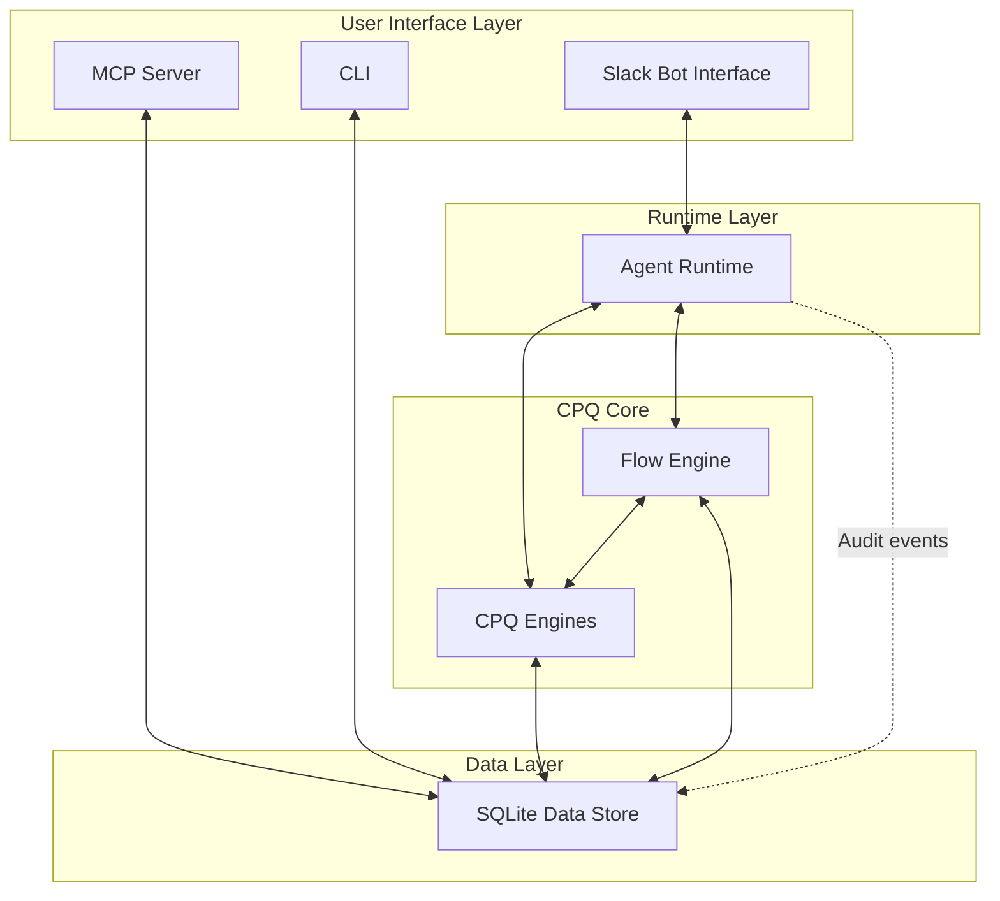
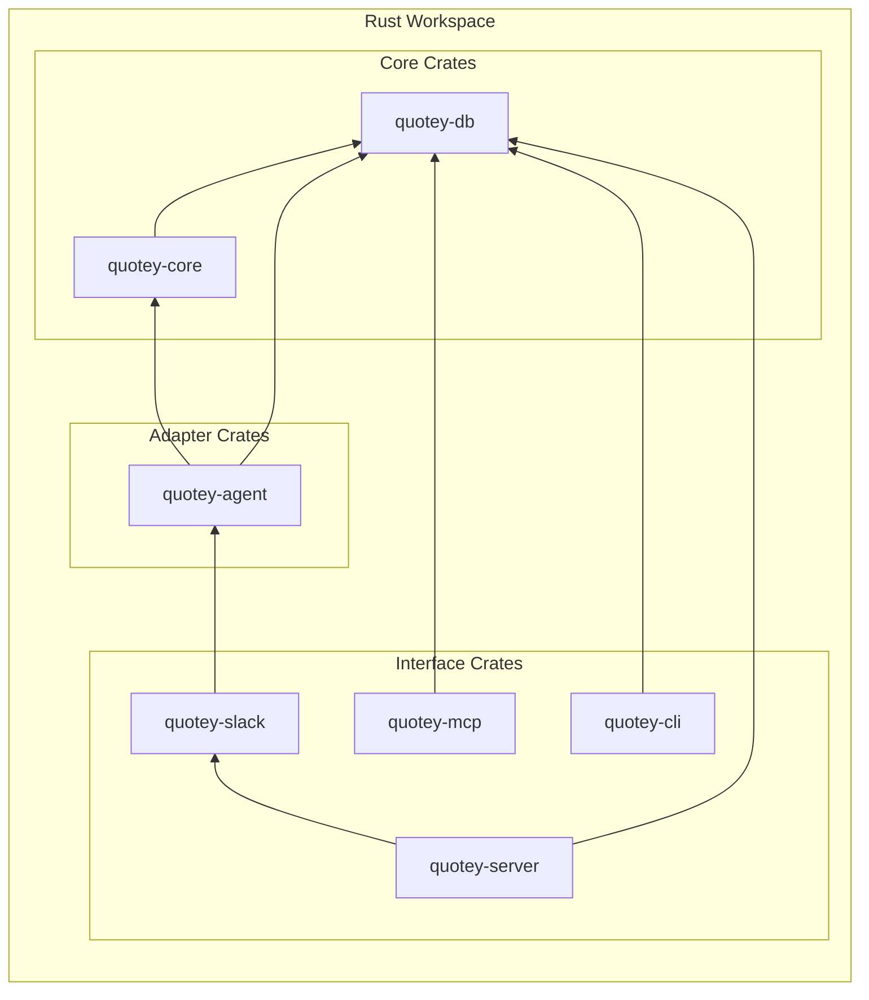
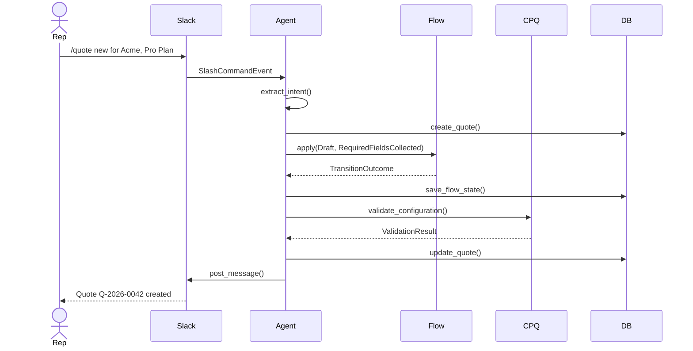
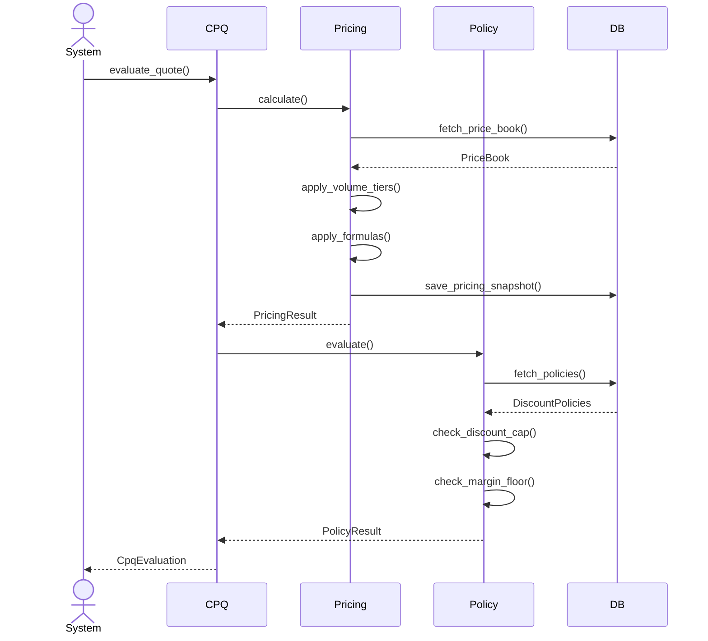

# Architecture Overview

Quotey is designed as a layered architecture with clear boundaries between deterministic and non-deterministic components. This document provides a high-level overview of how the system is organized.

## The Six-Box Model

At the highest level, Quotey consists of six major subsystems:

### 1. Slack Bot Interface

The primary user-facing interface. It uses **Socket Mode**, which means the bot connects to Slack via WebSocket — no public URL, no ngrok, no cloud deployment required.

**Responsibilities:**
- Listen for slash commands (`/quote new`, `/quote status`)
- Handle message events in threads
- Render interactive components (buttons, modals)
- Upload files (PDFs)
- Manage thread context

**Key Principle:** The Slack layer is thin. It translates Slack events into domain events and domain responses into Slack messages. No business logic lives here.

### 2. MCP Server

An AI-native interface using the Model Context Protocol (MCP). Allows AI agents to interact with Quotey programmatically.

**Responsibilities:**
- Expose tools for external AI agents
- Handle authentication and authorization
- Route tool calls to appropriate handlers
- Maintain audit trail

### 3. Agent Runtime

The "brain" of the system — but a carefully constrained brain. It translates between the natural language world and the deterministic world.

**Responsibilities:**
- Extract structured intent from natural language
- Choose next action based on flow state
- Enforce guardrails and tool permissions
- Manage conversation context
- Generate human-friendly responses

**Critical Constraint:** The agent decides _what to ask_, not _what the answer is_. Prices, configurations, and policies are always determined by the deterministic CPQ core.

### 4. Flow Engine

A state machine that owns "what happens next." It defines the required fields, allowed transitions, and completion criteria for every step of the quote lifecycle.

**States:** Draft → Validated → Priced → (Approval → Approved) → Finalized → Sent

**Responsibilities:**
- Validate state transitions
- Track missing required fields
- Trigger actions on state changes
- Maintain flow state persistence

### 5. CPQ Core

The heart of the deterministic engine. Contains four sub-engines:

#### 5a. Product Catalog

Stores configurable products, attributes, bundles, and relationships.

**Key Feature:** Catalog bootstrap from unstructured sources (CSV, PDF, spreadsheets) via the agent.

#### 5b. Constraint Engine

Validates configurations using constraint-based logic rather than rules-based.

**Constraint Types:**
- Requires/Excludes (product dependencies)
- Attribute constraints
- Quantity constraints
- Bundle constraints
- Cross-product constraints

#### 5c. Pricing Engine

Computes prices deterministically with full traceability.

**Pricing Pipeline:**
1. Select price book(s)
2. Look up base prices
3. Apply volume tiers
4. Apply bundle discounts
5. Apply formulas
6. Apply requested discounts
7. Generate pricing trace

#### 5d. Policy Engine

Evaluates business rules for discount caps, margin floors, and approval requirements.

**Policy Types:**
- Discount caps by segment
- Margin floors
- Deal size thresholds
- Product-specific policies
- Temporal policies (end-of-quarter rules)

### 6. SQLite Data Store

Everything persists locally in a single SQLite file. The schema is comprehensive enough for enterprise credibility while staying manageable.

**Key Tables:**
- Products, price books, bundles
- Quotes, quote lines, pricing snapshots
- Accounts, contacts, deals
- Approval requests, chains
- Audit events, flow states

## Layer Dependencies

### Dependency Rules

1. **Core has no external dependencies** — It's pure business logic with no I/O
2. **DB depends only on Core** — For domain types
3. **Agent depends on Core** — For business logic, never directly on DB
4. **Slack/CLI/MCP are adapters** — They depend on Agent and Core
5. **Server composes everything** — It's the wiring layer

## Data Flow Examples

### Creating a New Quote (Slack Flow)

### Pricing a Quote

## Technology Stack

### Runtime and Async

| Crate | Purpose |
|-------|---------|
| `tokio` | Async runtime |
| `tracing` | Structured logging |
| `anyhow` | Error handling (application) |
| `thiserror` | Error types (library) |

### Database

| Crate | Purpose |
|-------|---------|
| `sqlx` | Compile-time checked SQL |
| `sqlite` | Local database |

### Serialization

| Crate | Purpose |
|-------|---------|
| `serde` | Serialization framework |
| `serde_json` | JSON handling |
| `toml` | Config files |

### Slack

| Crate | Purpose |
|-------|---------|
| `slack-morphism` | Socket Mode support |

### HTTP

| Crate | Purpose |
|-------|---------|
| `reqwest` | HTTP client |

### LLM Integration

| Crate | Purpose |
|-------|---------|
| `async-trait` | Trait async methods |

### PDF Generation

| Crate | Purpose |
|-------|---------|
| `tera` | HTML templating |

## Security Considerations

### Data Protection

- All data stored locally in SQLite
- No data sent to external services except:
  - Slack API (for messaging)
  - LLM API (for intent extraction only)
  - CRM via Composio (optional)

### LLM Safety

- LLM never sees pricing rules or customer financial data
- LLM only extracts intent, never makes decisions
- All LLM calls are logged for audit

### API Authentication

- Slack: Token-based (Socket Mode)
- MCP: API key authentication
- CLI: Local-only, no auth needed

## Scalability Characteristics

### What Scales Well

- Number of products (SQLite handles millions of rows)
- Quote volume (single-node throughput)
- Concurrent users (SQLite WAL mode)

### Limitations

- Single-node architecture (no horizontal scaling)
- SQLite for very large deployments (10GB+ may need tuning)
- No built-in high availability

### When to Scale

For most mid-market deployments (hundreds of users, thousands of quotes/month), a single Quotey instance is sufficient. For larger deployments, consider:

1. **Read replicas** — For reporting/analytics queries
2. **External database** — PostgreSQL instead of SQLite
3. **Multiple instances** — With shared external database

## Next Steps

- [Six-Box Model](./six-box-model) — Detailed look at each subsystem
- [Data Flow](./data-flow) — How data moves through the system
- [Safety Principle](./safety-principle) — The most important architectural decision
- [Crate Reference](../crates/overview) — Deep dive into the code organization
