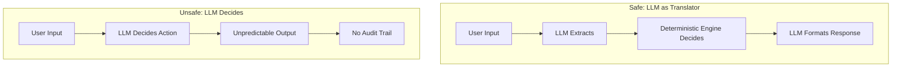

# The Safety Principle

This is the most important architectural decision in Quotey. Understanding and adhering to this principle is essential for safe, reliable operation.

## The Core Rule

> **The LLM is strictly a translator. It converts between formats but never makes business decisions.**

## What the LLM Does

The LLM acts as a translator between natural language and structured data:

| Input | Output | Example |
|-------|--------|---------|
| Natural language | Structured intent | "Pro Plan for 50 seats" → `ProductId("plan_pro")`, `quantity: 50` |
| Fuzzy product name | Product ID | "enterprise tier" → `ProductId("plan_enterprise")` |
| Structured data | Human-friendly summary | Quote → "Your quote totals $10,000" |
| Deal context | Approval justification | Quote + Context → "This discount is justified because..." |
| Document text | Structured requirements | RFP PDF → ExtractedRequirements |
| Unstructured catalog | Structured products | PDF datasheet → Product records |

## What the LLM NEVER Does

These are hard boundaries enforced by guardrails:

### ❌ Setting Prices

**Wrong:** LLM suggests a price based on context.
```
User: "What's a good price for 100 seats?"
LLM: "Based on similar deals, $8,000 would be competitive"
```

**Right:** LLM extracts intent, pricing engine calculates.
```
User: "Quote me Pro Plan for 100 seats"
LLM: extracts { product: "Pro Plan", quantity: 100 }
Pricing Engine: calculates $10,000 based on price book
```

### ❌ Validating Configurations

**Wrong:** LLM decides if a configuration is valid.
```
User: "Add SSO to Basic Plan"
LLM: "That should work fine"
```

**Right:** Constraint engine validates.
```
User: "Add SSO to Basic Plan"
Constraint Engine: ERROR - SSO requires Enterprise Tier
```

### ❌ Approving Discounts

**Wrong:** LLM approves a discount request.
```
User: "Can I give a 25% discount?"
LLM: "That seems reasonable for this deal size"
```

**Right:** Policy engine evaluates, human approves.
```
User: "Request 25% discount"
Policy Engine: VIOLATION - exceeds 20% cap
Workflow: Routes to VP Sales for approval
```

### ❌ Choosing Workflow Steps

**Wrong:** LLM decides what to do next.
```
User: "I need to get this quote approved"
LLM: "I'll send it to the deal desk channel"
```

**Right:** Flow engine determines next steps.
```
User: "Request approval"
Flow Engine: Current state = Priced, Policy = Violation
Transition: Priced → Approval
Actions: [RouteApproval]
```

## Why This Matters

### 1. Contractual Liability

An LLM hallucinating a price can create legal liability:
- Customer receives quote for $5,000
- LLM "thought" that was reasonable
- Actual price should be $10,000
- **Result:** Contract dispute, financial loss

### 2. Audit Requirements

Enterprise sales requires audit trails:
- "How was this price calculated?"
- "Who approved this discount?"
- "What constraints were checked?"

LLM reasoning is opaque and non-reproducible.
Deterministic engines produce clear, replayable traces.

### 3. Consistency

Same input should produce same output:
- Rep A and Rep B quoting same configuration
- Should get same price (before discounts)
- LLM might vary; deterministic engine won't

### 4. Debugging

When something goes wrong:
- Deterministic bug: Reproduce, fix, verify
- LLM bug: May not reproduce, hard to trace

## Guardrails Implementation

The guardrails system enforces these boundaries:

```rust
pub enum GuardrailIntent {
    // ✅ ALLOWED: Queue actions
    QueueAction { quote_id, task_id, action },
    
    // ❌ DENIED: Price overrides
    PriceOverride { quote_id, requested_price },
    
    // ❌ DENIED: Discount approval
    DiscountApproval { quote_id, requested_discount_pct },
}

impl GuardrailPolicy {
    pub fn evaluate(&self, intent: &GuardrailIntent) -> GuardrailDecision {
        match intent {
            // ✅ Queue actions are safe
            GuardrailIntent::QueueAction { .. } => GuardrailDecision::Allow,
            
            // ❌ NEVER allow LLM to set prices
            GuardrailIntent::PriceOverride { .. } => GuardrailDecision::Deny {
                reason_code: "price_override_disallowed",
                user_message: "I cannot set prices. Use deterministic pricing.",
                fallback_path: "deterministic_pricing_workflow",
            },
            
            // ❌ NEVER allow LLM to approve discounts
            GuardrailIntent::DiscountApproval { .. } => GuardrailDecision::Deny {
                reason_code: "discount_approval_disallowed",
                user_message: "I cannot approve discounts. Use approval workflow.",
                fallback_path: "approval_workflow",
            },
        }
    }
}
```

## The Agent Loop

The safety principle shapes the entire agent loop:

```
┌─────────────────────────────────────────────────────────────┐
│  1. RECEIVE MESSAGE                                         │
│     User types in Slack                                     │
└─────────────────────────────────────────────────────────────┘
                            ↓
┌─────────────────────────────────────────────────────────────┐
│  2. EXTRACT INTENT (LLM) ✅                                 │
│     NL → Structured intent (QuoteIntent)                    │
│     "50 seats of Pro" → { product: Pro, qty: 50 }          │
└─────────────────────────────────────────────────────────────┘
                            ↓
┌─────────────────────────────────────────────────────────────┐
│  3. CHECK GUARDRAILS                                        │
│     Is this intent allowed?                                 │
│     - Price change? → DENY                                  │
│     - Discount approval? → DENY                             │
│     - Normal quote operation? → ALLOW                       │
└─────────────────────────────────────────────────────────────┘
                            ↓
┌─────────────────────────────────────────────────────────────┐
│  4. LOAD STATE                                              │
│     Get current quote from database                         │
│     (Deterministic - same query always returns same data)   │
└─────────────────────────────────────────────────────────────┘
                            ↓
┌─────────────────────────────────────────────────────────────┐
│  5. DETERMINE NEXT ACTION (FLOW ENGINE)                     │
│     What should happen next?                                │
│     - Missing fields? → Prompt for them                     │
│     - Ready to price? → Run pricing engine                  │
│     - Policy violation? → Route approval                    │
│     (Deterministic - state machine decides)                 │
└─────────────────────────────────────────────────────────────┘
                            ↓
┌─────────────────────────────────────────────────────────────┐
│  6. EXECUTE ACTION (CPQ ENGINE)                             │
│     • Constraint validation                                 │
│     • Pricing calculation                                   │
│     • Policy evaluation                                     │
│     (All deterministic - reproducible, auditable)           │
└─────────────────────────────────────────────────────────────┘
                            ↓
┌─────────────────────────────────────────────────────────────┐
│  7. SAVE RESULTS                                            │
│     Persist quote, pricing snapshot, audit events           │
└─────────────────────────────────────────────────────────────┘
                            ↓
┌─────────────────────────────────────────────────────────────┐
│  8. GENERATE RESPONSE (LLM) ✅                              │
│     Structured result → Human-friendly text                 │
│     PricingResult → "Your quote totals $10,000"             │
└─────────────────────────────────────────────────────────────┘
```

## LLM vs Deterministic: Visual Comparison



## Common Questions

### "Doesn't this limit what the agent can do?"

Yes, intentionally. The limits are features, not bugs:
- Limited scope = Predictable behavior
- Limited scope = Testable behavior
- Limited scope = Auditable behavior

### "What if the LLM extraction is wrong?"

There are safeguards:
1. **Extraction is verified** against valid products/values
2. **User confirms** ambiguous extractions
3. **Fallback to structured input** (Slack modals)
4. **User can correct** before proceeding

### "Can I disable guardrails for my use case?"

No. Guardrails are non-configurable for safety reasons.
If you need different behavior, extend the deterministic engines,
don't bypass the safety controls.

### "How do I add new capabilities?"

1. Define deterministic logic in the core engines
2. Add new tool for the agent to call
3. Map natural language to the tool via LLM extraction
4. Guardrails ensure the tool is used appropriately

## Audit Implications

Every LLM call is logged:

```sql
CREATE TABLE llm_interaction_log (
    id TEXT PRIMARY KEY,
    timestamp TEXT NOT NULL,
    provider TEXT NOT NULL,
    model TEXT NOT NULL,
    purpose TEXT NOT NULL,  -- 'intent_extraction', 'summary_generation', etc.
    input_text TEXT NOT NULL,
    output_text TEXT NOT NULL,
    quote_id TEXT,
    success BOOLEAN NOT NULL
);
```

This enables:
- Debugging extraction failures
- Cost tracking
- Quality comparison between providers
- Audit trail for any LLM-influenced output

## Summary

| Aspect | LLM Role | Deterministic Engine Role |
|--------|----------|--------------------------|
| Input understanding | ✅ Translate NL to structured | — |
| Business logic | ❌ Never | ✅ Always decide |
| Output formatting | ✅ Structured to NL | — |
| Pricing | ❌ Never calculate | ✅ Always calculate |
| Configuration | ❌ Never validate | ✅ Always validate |
| Approvals | ❌ Never approve | ✅ Route to humans |
| Audit trail | ❌ Never the source | ✅ Always the source |

## See Also

- [Architecture Overview](./overview) — System design
- [Agent Runtime](../crates/agent) — How the agent works
- [Guardrails](../crates/agent#guardrails) — Safety enforcement
