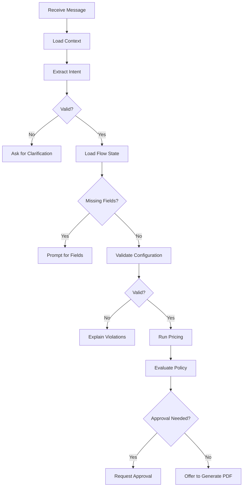
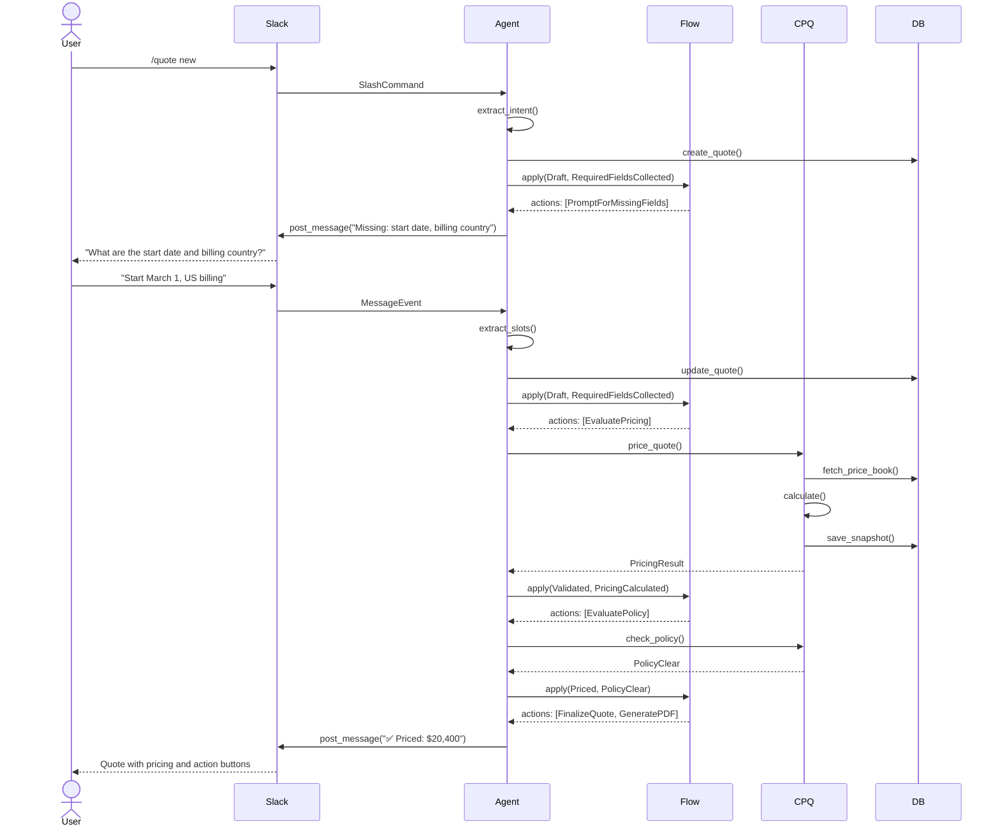

# The Six-Box Model

This document provides a detailed explanation of each of the six major subsystems that make up Quotey.

## Box 1: Slack Bot Interface

### Purpose

The Slack Bot Interface is the primary entry point for user interaction. It bridges the gap between Slack's WebSocket API and Quotey's internal domain events.

### Why Socket Mode?

**Socket Mode** means the bot connects to Slack via WebSocket rather than receiving HTTP webhooks. This is crucial for Quotey's local-first philosophy:

- ✅ No public URL required
- ✅ No ngrok or tunneling for development
- ✅ Runs on a laptop behind NAT
- ✅ No cloud infrastructure needed

### Components

```rust
// crates/slack/src/socket.rs
pub struct SocketModeRunner {
    client: SlackClient,
    event_handler: EventDispatcher,
}

impl SocketModeRunner {
    pub async fn run(&self) -> Result<()> {
        // Connects to Slack WebSocket
        // Dispatches events to handlers
        // Handles reconnection automatically
    }
}
```

| Module | Responsibility |
|--------|---------------|
| `socket.rs` | WebSocket connection, event loop, reconnection |
| `commands.rs` | Slash command parsing (`/quote new`, etc.) |
| `events.rs` | Message event handling (thread replies) |
| `blocks.rs` | Slack Block Kit UI builders |

### Event Flow

```
Slack WebSocket
    ↓
Slack Event (JSON)
    ↓
socket.rs parses → SlackEvent enum
    ↓
events.rs matches event type
    ↓
Convert to DomainEvent
    ↓
Send to Agent Runtime
```

### Example: Handling a Slash Command

```rust
// crates/slack/src/commands.rs
async fn handle_quote_command(
    command: &SlackSlashCommand,
    agent: &AgentRuntime,
) -> Result<SlackMessage> {
    // Parse the command text
    let intent = parse_command_text(&command.text)?;
    
    // Send to agent runtime
    let result = agent.process_intent(
        IntentContext::new(command.user_id.clone())
            .with_channel(command.channel_id.clone()),
        intent,
    ).await?;
    
    // Convert result to Slack blocks
    Ok(blocks::quote_created_message(&result))
}
```

## Box 2: Agent Runtime

### Purpose

The Agent Runtime orchestrates the interaction between natural language input and the deterministic CPQ core. It's the "brain" — but a carefully constrained one.

### The Agent Loop



### Guardrails in Action

```rust
// crates/agent/src/guardrails.rs
pub enum GuardrailIntent {
    QueueAction { quote_id, task_id, action },
    PriceOverride { quote_id, requested_price },
    DiscountApproval { quote_id, discount_pct },
}

impl GuardrailPolicy {
    pub fn evaluate(&self, intent: &GuardrailIntent) -> GuardrailDecision {
        match intent {
            // ❌ NEVER allow LLM to set prices
            GuardrailIntent::PriceOverride { .. } => GuardrailDecision::Deny {
                reason_code: "price_override_disallowed",
                user_message: "I cannot set prices from chat...",
                fallback_path: "deterministic_pricing_workflow",
            },
            
            // ✅ Allow queue actions when enabled
            GuardrailIntent::QueueAction { .. } if self.queue_actions_enabled => {
                GuardrailDecision::Allow
            }
        }
    }
}
```

### LLM Integration

The LLM trait is pluggable — you can use OpenAI, Anthropic, or local Ollama:

```rust
// crates/agent/src/llm.rs
#[async_trait]
pub trait LlmClient: Send + Sync {
    async fn complete(&self, prompt: &str) -> Result<String>;
}

// Implementations:
// - OpenAiClient
// - AnthropicClient  
// - OllamaClient
```

**What the LLM does:**
- Extract structured fields from natural language
- Map fuzzy product names to product IDs
- Generate human-friendly summaries
- Draft approval justification text

**What the LLM does NOT do:**
- Decide prices
- Validate configurations
- Approve discounts
- Choose workflow steps

## Box 3: Flow Engine

### Purpose

The Flow Engine is a deterministic state machine that owns "what happens next." It ensures quotes follow valid lifecycle paths.

### State Machine Design

```rust
// crates/core/src/flows/states.rs
pub enum FlowState {
    Draft,
    Validated,
    Priced,
    Approval,
    Approved,
    Finalized,
    Sent,
    Revised,
    Expired,
    Cancelled,
    Rejected,
}

pub enum FlowEvent {
    RequiredFieldsCollected,
    PricingCalculated,
    PolicyClear,
    PolicyViolationDetected,
    ApprovalGranted,
    ApprovalDenied,
    QuoteDelivered,
    ReviseRequested,
    CancelRequested,
    QuoteExpired,
}
```

### Transition Logic

```rust
// crates/core/src/flows/engine.rs
fn transition_net_new(
    current: &FlowState,
    event: &FlowEvent,
    context: &FlowContext,
) -> Result<TransitionOutcome, FlowTransitionError> {
    let (to, actions) = match (current, event) {
        // Draft → Validated when all fields collected
        (Draft, RequiredFieldsCollected) => {
            if !context.missing_required_fields.is_empty() {
                (Draft, vec![PromptForMissingFields])
            } else {
                (Validated, vec![EvaluatePricing])
            }
        }
        
        // Validated → Priced after pricing calculated
        (Validated, PricingCalculated) => {
            (Priced, vec![EvaluatePolicy])
        }
        
        // Priced → Approval if policy violation
        (Priced, PolicyViolationDetected) => {
            (Approval, vec![RouteApproval])
        }
        
        // Priced → Finalized if policy clear
        (Priced, PolicyClear) => {
            (Finalized, vec![
                FinalizeQuote,
                GenerateConfigurationFingerprint,
                GenerateDeliveryArtifacts,
            ])
        }
        
        // Invalid transitions are rejected
        _ => return Err(InvalidTransition { state: current, event }),
    };
    
    Ok(TransitionOutcome { from: current.clone(), to, actions })
}
```

### Flow Types

| Flow | Use Case | Key Characteristics |
|------|----------|-------------------|
| **NetNew** | New customers | Full configuration, standard pricing |
| **Renewal** | Existing customers | Loyalty pricing, delta comparisons |
| **DiscountException** | Special pricing | Multi-level approval chains |

## Box 4: CPQ Core

The CPQ Core is the heart of the deterministic engine. It contains four sub-engines:

### 4a: Product Catalog

```rust
// crates/core/src/domain/product.rs
pub struct Product {
    pub id: ProductId,
    pub sku: String,
    pub name: String,
    pub description: Option<String>,
    pub product_type: ProductType,  // Simple, Configurable, Bundle
    pub category: Option<String>,
    pub attributes: Vec<Attribute>,
}

pub enum ProductType {
    Simple,       // Standalone product
    Configurable, // Has options/variants
    Bundle,       // Contains other products
}
```

**Catalog Bootstrap:** The agent can ingest unstructured data:
- CSV files → Product rows
- PDFs → Extracted via LLM → Products
- Spreadsheets → Price matrices

### 4b: Constraint Engine

```rust
// crates/core/src/cpq/constraints.rs
pub enum Constraint {
    Requires { source, target },
    Excludes { source, target },
    Attribute { product, condition },
    Quantity { product, min, max },
    BundleComposition { bundle, rules },
}

pub struct ConstraintResult {
    pub valid: bool,
    pub violations: Vec<ConstraintViolation>,
    pub suggestions: Vec<Suggestion>,
}
```

**Example Constraints:**
```
SSO Add-on REQUIRES Enterprise Tier
Basic Support EXCLUDES 24/7 SLA
Enterprise Tier REQUIRES min 50 seats
Bundle: Starter = 1 base + 1 support
```

### 4c: Pricing Engine

```rust
// crates/core/src/cpq/pricing.rs
pub struct PricingEngine {
    price_book_repo: Arc<dyn PriceBookRepository>,
    formula_engine: FormulaEngine,
}

impl PricingEngine {
    pub fn price(&self, quote: &Quote) -> PricingResult {
        // 1. Select price book
        let price_book = self.select_price_book(quote)?;
        
        // 2. Look up base prices
        let mut lines = vec![];
        for line in &quote.lines {
            let entry = price_book.get_entry(&line.product_id)?;
            let base_price = entry.unit_price;
            
            // 3. Apply volume tiers
            let tiered_price = self.apply_volume_tiers(entry, line.quantity);
            
            // 4. Apply formulas
            let formula_result = self.apply_formulas(&tiered_price, quote)?;
            
            // 5. Apply discounts
            let discounted = self.apply_discounts(formula_result, line.discount_pct);
            
            lines.push(PricedLine { /* ... */ });
        }
        
        // 6. Compute totals
        // 7. Generate pricing trace
        PricingResult { lines, trace }
    }
}
```

### 4d: Policy Engine

```rust
// crates/core/src/cpq/policy.rs
pub struct PolicyEngine {
    policies: Vec<Box<dyn Policy>>,
}

pub trait Policy: Send + Sync {
    fn evaluate(&self, quote: &Quote, pricing: &PricingResult) -> PolicyOutcome;
}

pub enum PolicyOutcome {
    Pass,
    ApprovalRequired { level, reason },
    Block { reason },
}

// Example policies:
pub struct DiscountCapPolicy { max_discount_pct: Decimal }
pub struct MarginFloorPolicy { min_margin_pct: Decimal }
pub struct DealSizePolicy { threshold: Decimal, approver: Role }
```

## Box 5: Tool Adapters

Tool adapters provide a clean interface between the agent and external systems.

### Design Principle

Each tool adapter implements a trait. The agent calls tools through the trait, never directly. This enables:
- Stubbed implementations for testing
- Multiple implementations (Composio vs. stubbed CRM)
- Easy mocking in tests

### Slack Tools

```rust
#[async_trait]
pub trait SlackTools: Send + Sync {
    async fn post_message(&self, channel, thread_ts, blocks) -> Result<MessageTs>;
    async fn update_message(&self, channel, ts, blocks) -> Result<()>;
    async fn open_modal(&self, trigger_id, view) -> Result<()>;
    async fn upload_file(&self, channel, thread_ts, file, title) -> Result<FileId>;
}
```

### CRM Tools

```rust
#[async_trait]
pub trait CrmAdapter: Send + Sync {
    async fn lookup_account(&self, query) -> Result<Option<Account>>;
    async fn get_deal(&self, deal_id) -> Result<Option<Deal>>;
    async fn create_deal(&self, account_id, data) -> Result<Deal>;
    async fn update_deal(&self, deal_id, updates) -> Result<Deal>;
}

// Implementations:
// - StubCrmAdapter (CSV fixtures → SQLite)
// - ComposioCrmAdapter (Composio REST API)
```

### CPQ Tools

```rust
#[async_trait]
pub trait CpqTools: Send + Sync {
    async fn search_products(&self, query) -> Result<Vec<Product>>;
    async fn validate_configuration(&self, lines) -> Result<ValidationResult>;
    async fn price_quote(&self, quote_id) -> Result<PricingResult>;
    async fn check_policy(&self, quote_id) -> Result<PolicyResult>;
}
```

## Box 6: SQLite Data Store

### Schema Organization

The database schema is organized into logical groups:

**Reference Data:**
- `product` — Catalog of sellable items
- `price_book` — Named collections of prices
- `price_book_entry` — Individual product prices
- `constraint_rule` — Configuration constraints
- `discount_policy` — Approval thresholds

**Transactional Data:**
- `quote` — Quote headers
- `quote_line` — Line items
- `quote_pricing_snapshot` — Immutable pricing history
- `approval_request` — Approval tracking
- `flow_state` — Current workflow position

**Audit Data:**
- `audit_event` — Complete action history
- `llm_interaction_log` — Every LLM call
- `slack_thread_map` — Quote ↔ Slack association

### Key Design Decisions

1. **JSON columns for flexibility** — `attributes_json`, `context_json` allow schema evolution
2. **Immutable snapshots** — Pricing snapshots are never updated, only appended
3. **Soft deletes** — Most tables use `active` flag rather than hard deletion
4. **Audit everything** — Every action produces an audit event

### Connection Management

```rust
// crates/db/src/connection.rs
pub type DbPool = Pool<Sqlite>;

pub async fn connect(database_url: &str) -> Result<DbPool> {
    let pool = SqlitePoolOptions::new()
        .max_connections(5)
        .connect(database_url)
        .await?;
    
    // Enable WAL mode for concurrent access
    sqlx::query("PRAGMA journal_mode = WAL")
        .execute(&pool)
        .await?;
    
    Ok(pool)
}
```

## Interactions Between Boxes

### Happy Path: Creating a Quote



## Next Steps

- [Data Flow](./data-flow) — See more detailed data flow examples
- [Safety Principle](./safety-principle) — Understand the LLM/determinism boundary
- [Crate Reference](../crates/overview) — Explore the code implementation
