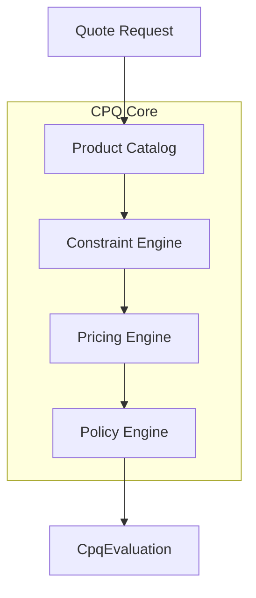
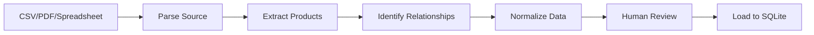
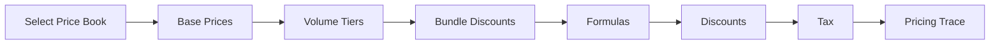

# CPQ Engine

The CPQ (Configure, Price, Quote) Engine is the deterministic heart of Quotey. It comprises four sub-engines: Product Catalog, Constraint Engine, Pricing Engine, and Policy Engine.

## Overview



All four engines are deterministic: given the same inputs, they always produce the same outputs. This is critical for auditability and trust.

## Product Catalog

The Product Catalog stores all configurable products, their attributes, valid options, bundles, and relationships.

### Product Types

| Type | Description | Example |
|------|-------------|---------|
| **Simple** | Standalone product with no options | "Premium Support - $500/mo" |
| **Configurable** | Has attributes with allowed values | "Pro Plan" with seat tiers |
| **Bundle** | Contains multiple products | "Starter Package" |

### Product Model

```rust
pub struct Product {
    pub id: ProductId,
    pub sku: String,
    pub name: String,
    pub description: Option<String>,
    pub product_type: ProductType,
    pub category: Option<String>,
    pub attributes: Vec<Attribute>,
    pub relationships: Vec<ProductRelationship>,
}

pub struct Attribute {
    pub name: String,
    pub attr_type: AttributeType,  // String, Number, Boolean, Enum
    pub allowed_values: Option<Vec<String>>,
    pub default_value: Option<String>,
    pub required: bool,
}
```

### Catalog Bootstrap

A key differentiator for Quotey is the ability to bootstrap the catalog from unstructured sources:



**Supported Sources:**
- CSV files with mapped columns
- PDF product sheets (LLM-assisted extraction)
- Spreadsheets with pricing matrices
- Unstructured text descriptions

The agent presents extracted data for human review before loading — this 80% automation saves months of manual data entry.

## Constraint Engine

The Constraint Engine validates product configurations. It uses **constraint-based** logic rather than rules-based logic.

### Why Constraints Over Rules?

**Rules-Based (Traditional CPQ):**
```
If A then B required
If A then C excluded
If B and D then E required
...
```
For N options, you need O(N²) rules → combinatorial explosion.

**Constraint-Based (Quotey):**
```
Motor voltage MUST MATCH enclosure rating
Enclosure thermal rating MUST EXCEED motor heat
Bundle MUST CONTAIN exactly 1 base + 1 support
```
A few constraints replace hundreds of rules.

### Constraint Types

#### 1. Requires Constraint

```rust
Constraint::Requires {
    source: ProductId("sso_addon"),
    target: ProductId("enterprise_tier"),
    condition: None,
}
```

**Meaning:** "SSO Add-on requires Enterprise Tier"

#### 2. Excludes Constraint

```rust
Constraint::Excludes {
    source: ProductId("basic_support"),
    target: ProductId("24_7_sla"),
    condition: None,
}
```

**Meaning:** "Basic Support excludes 24/7 SLA"

#### 3. Attribute Constraint

```rust
Constraint::Attribute {
    product: ProductId("any"),
    condition: Condition::And(vec![
        Condition::Eq("billing_country", "EU"),
        Condition::Eq("currency", "EUR"),
    ]),
}
```

**Meaning:** "If billing country is EU, currency must be EUR"

#### 4. Quantity Constraint

```rust
Constraint::Quantity {
    product: ProductId("enterprise_tier"),
    min: Some(50),
    max: None,
}
```

**Meaning:** "Enterprise Tier requires minimum 50 seats"

#### 5. Bundle Constraint

```rust
Constraint::BundleComposition {
    bundle: ProductId("starter_package"),
    rules: vec![
        BundleRule::Required(ProductId("base_plan"), 1, 1),
        BundleRule::Required(ProductId("support_tier"), 1, 1),
        BundleRule::Optional(ProductId("addon_sso"), 0, 1),
    ],
}
```

**Meaning:** "Starter Package must contain exactly 1 base plan and 1 support tier"

#### 6. Cross-Product Constraint

```rust
Constraint::CrossProduct {
    condition: Condition::SumLTE(
        vec!["plan_a_seats", "plan_b_seats"],
        "total_license_cap",
    ),
}
```

**Meaning:** "Total seats across all plans must not exceed license cap"

### Constraint Evaluation

```rust
pub struct ConstraintEngine;

impl ConstraintEngine {
    pub fn validate(
        &self,
        lines: &[QuoteLine],
        constraints: &[Constraint],
    ) -> ConstraintResult {
        let mut violations = vec![];
        let mut suggestions = vec![];
        
        for constraint in constraints {
            match self.check_constraint(lines, constraint) {
                Ok(()) => continue,
                Err(violation) => {
                    violations.push(violation.clone());
                    if let Some(suggestion) = self.suggest_fix(&violation) {
                        suggestions.push(suggestion);
                    }
                }
            }
        }
        
        ConstraintResult {
            valid: violations.is_empty(),
            violations,
            suggestions,
        }
    }
}
```

### Constraint Result

```rust
pub struct ConstraintResult {
    pub valid: bool,
    pub violations: Vec<ConstraintViolation>,
    pub suggestions: Vec<Suggestion>,
}

pub struct ConstraintViolation {
    pub constraint_id: String,
    pub constraint_type: ConstraintType,
    pub message: String,  // Human-readable explanation
    pub affected_products: Vec<ProductId>,
}

pub struct Suggestion {
    pub action: SuggestionAction,  // Add, Remove, Change
    pub target: ProductId,
    pub details: String,
}
```

**Example Output:**
```
❌ Configuration Invalid

Violations:
  • SSO Add-on requires Enterprise Tier
    → Add Enterprise Tier or remove SSO Add-on
    
  • Total seats (200) exceeds license cap (150)
    → Reduce seats to 150 or request license increase
```

## Pricing Engine

The Pricing Engine computes prices deterministically with full traceability.

### Pricing Pipeline



### Step 1: Select Price Book

Price books are selected based on:
- Customer segment
- Region
- Currency
- Deal type

```rust
pub struct PriceBook {
    pub id: PriceBookId,
    pub name: String,
    pub currency: Currency,
    pub segment: Option<Segment>,
    pub region: Option<Region>,
    pub priority: i32,  // Higher = selected first
    pub valid_from: DateTime<Utc>,
    pub valid_to: DateTime<Utc>,
    pub entries: Vec<PriceBookEntry>,
}
```

### Step 2: Base Prices

Each line item gets its unit price from the selected price book:

```rust
let entry = price_book.get_entry(&line.product_id)
    .ok_or_else(|| PricingError::NoPriceFound(line.product_id.clone()))?;

let base_price = entry.unit_price;
```

**Critical Rule:** If no price book entry exists, flag as error — never guess.

### Step 3: Volume Tiers

Quantity-based price breaks:

```rust
pub struct VolumeTier {
    pub min_quantity: i32,
    pub max_quantity: Option<i32>,  // None = unlimited
    pub unit_price: Decimal,
}

// Example:
// Pro Plan tiers:
//   1-49:   $10.00/seat
//   50-99:  $8.00/seat
//   100+:   $6.00/seat
```

### Step 4: Bundle Discounts

Discounts for purchasing certain combinations:

```rust
pub struct BundleDiscount {
    pub products: Vec<ProductId>,
    pub discount_type: DiscountType,  // Percentage, FixedAmount
    pub discount_value: Decimal,
}

// Example:
// Buy base + SSO + premium support = 15% bundle discount
```

### Step 5: Formulas

Custom pricing expressions:

```rust
pub struct PricingFormula {
    pub id: FormulaId,
    pub expression: String,  // "unit_price * quantity * (term_months / 12)"
    pub variables: Vec<Variable>,
    pub applies_to: AppliesTo,  // Products, categories, or segments
}
```

Formula evaluation uses a safe expression evaluator (no arbitrary code execution).

### Step 6: Apply Discounts

Rep-requested discounts:

```rust
let discount_amount = subtotal * (line.discount_pct / 100);
let discounted_subtotal = subtotal - discount_amount;
```

Discounts are validated by the Policy Engine (coming next).

### Step 7: Generate Pricing Trace

Every pricing calculation produces an immutable trace:

```json
{
  "quote_id": "Q-2026-0042",
  "priced_at": "2026-02-23T14:30:00Z",
  "currency": "USD",
  "price_book_id": "pb_enterprise_us",
  "price_book_selection_reason": "segment=enterprise, region=US",
  "lines": [
    {
      "line_id": "ql_001",
      "product_id": "plan_pro_v2",
      "quantity": 150,
      "base_unit_price": 10.00,
      "base_price_source": "price_book_entry:pbe_042",
      "volume_tier_applied": {
        "tier": "100+",
        "tier_unit_price": 6.00,
        "savings_per_unit": 4.00
      },
      "formula_applied": {
        "formula_id": "f_annual",
        "expression": "unit_price * quantity * (term_months / 12)",
        "inputs": {"unit_price": 6.00, "quantity": 150, "term_months": 12},
        "result": 14400.00
      },
      "discount_applied": {
        "type": "percentage",
        "requested": 10.0,
        "amount": 1440.00
      },
      "line_total": 12960.00
    }
  ],
  "subtotal": 12960.00,
  "discount_total": 1440.00,
  "tax": {"rate": 0.0, "amount": 0.00},
  "total": 12960.00
}
```

This trace is stored immutably. If re-priced, a new snapshot is created.

## Policy Engine

The Policy Engine evaluates business rules to determine if a quote can proceed, requires approval, or is blocked.

### Policy Types

#### 1. Discount Cap Policy

```rust
pub struct DiscountCapPolicy {
    pub segment: Option<Segment>,
    pub product_category: Option<String>,
    pub max_discount_auto: Decimal,      // Auto-approve up to this
    pub max_discount_with_approval: Decimal,  // Approve up to this
    pub required_approver_role: Option<Role>,
}

// Examples:
// SMB: max 10% auto, 20% with approval
// Enterprise: max 20% auto, 40% with approval
// Any: >40% blocked
```

#### 2. Margin Floor Policy

```rust
pub struct MarginFloorPolicy {
    pub product_category: Option<String>,
    pub min_margin_pct: Decimal,
}

// Examples:
// SaaS products: min 60% margin
// Services: min 40% margin
```

#### 3. Deal Size Threshold Policy

```rust
pub struct DealSizePolicy {
    pub threshold: Decimal,
    pub comparison: Comparison,  // GT, GTE, LT, LTE
    pub required_role: Role,
}

// Examples:
// >$100K: Deal Desk review required
// >$500K: VP Sales approval required
```

#### 4. Product-Specific Policy

```rust
pub struct ProductPolicy {
    pub product_id: ProductId,
    pub condition: PolicyCondition,
    pub action: PolicyAction,
}

// Examples:
// Custom SLA → Legal review required
// Free onboarding → Manager approval required
```

#### 5. Temporal Policy

```rust
pub struct TemporalPolicy {
    pub condition: TemporalCondition,
    pub action: PolicyAction,
}

// Examples:
// End-of-quarter + >15% discount → Extra scrutiny
// Quote age >30 days → Auto-expire
```

### Policy Evaluation

```rust
pub struct PolicyEngine {
    policies: Vec<Box<dyn Policy>>,
}

impl PolicyEngine {
    pub fn evaluate(&self, quote: &Quote, pricing: &PricingResult) -> PolicyEvaluation {
        let mut outcomes = vec![];
        let mut approval_required = false;
        let mut blocked = false;
        
        for policy in &self.policies {
            let outcome = policy.evaluate(quote, pricing);
            match &outcome {
                PolicyOutcome::Pass => {}
                PolicyOutcome::ApprovalRequired { .. } => approval_required = true,
                PolicyOutcome::Block { .. } => blocked = true,
            }
            outcomes.push(outcome);
        }
        
        PolicyEvaluation {
            can_proceed: !blocked,
            approval_required,
            outcomes,
        }
    }
}
```

### Policy Evaluation Output

```rust
pub struct PolicyEvaluation {
    pub can_proceed: bool,
    pub approval_required: bool,
    pub outcomes: Vec<PolicyOutcome>,
}

pub enum PolicyOutcome {
    Pass,
    ApprovalRequired {
        policy_id: String,
        reason: String,
        approver_role: Role,
        severity: Severity,  // Minor, Major, Critical
    },
    Block {
        policy_id: String,
        reason: String,
    },
}
```

**Example Output:**
```json
{
  "quote_id": "Q-2026-0042",
  "can_proceed": true,
  "approval_required": true,
  "outcomes": [
    {
      "policy": "discount_cap_smb",
      "result": "approval_required",
      "reason": "15% discount exceeds 10% cap for SMB segment",
      "approver_role": "sales_manager",
      "severity": "major"
    },
    {
      "policy": "margin_floor_saas",
      "result": "pass"
    }
  ]
}
```

## Integration: CpqRuntime

The four engines are combined behind a unified trait:

```rust
#[async_trait]
pub trait CpqRuntime: Send + Sync {
    async fn evaluate_quote(&self, input: CpqEvaluationInput) -> CpqEvaluation;
}

pub struct CpqEvaluationInput<'a> {
    pub quote: &'a Quote,
    pub currency: &'a str,
    pub policy_input: PolicyInput,
}

pub struct CpqEvaluation {
    pub constraints: ConstraintResult,
    pub pricing: PricingResult,
    pub policy: PolicyEvaluation,
}
```

### DeterministicCpqRuntime

The default implementation wires all four engines together:

```rust
pub struct DeterministicCpqRuntime<C, P, O> 
where
    C: ConstraintEngine,
    P: PricingEngine,
    O: PolicyEngine,
{
    constraint_engine: C,
    pricing_engine: P,
    policy_engine: O,
}

impl<C, P, O> CpqRuntime for DeterministicCpqRuntime<C, P, O> {
    async fn evaluate_quote(&self, input: CpqEvaluationInput) -> CpqEvaluation {
        // 1. Validate constraints
        let constraints = self.constraint_engine.validate(&input.quote.lines);
        
        // 2. Calculate pricing (even if constraints fail, for feedback)
        let pricing = self.pricing_engine.price(&input.quote).await;
        
        // 3. Evaluate policies
        let policy = self.policy_engine.evaluate(&input.quote, &pricing);
        
        CpqEvaluation {
            constraints,
            pricing,
            policy,
        }
    }
}
```

## Next Steps

- [Flow Engine](./flow-engine) — Learn about the state machine that drives quotes
- [Determinism](./determinism) — Deep dive into why determinism matters
- [Database Schema](../api/database-schema) — Explore the data model
