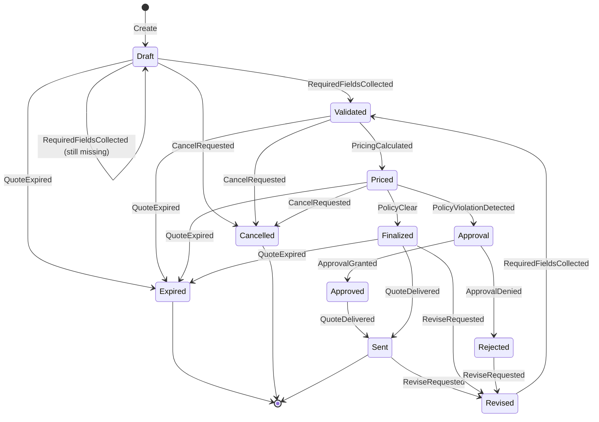

# Flow Engine

The Flow Engine is a deterministic state machine that manages the quote lifecycle. It ensures quotes progress through valid states and triggers appropriate actions at each transition.

## Why a State Machine?

Quotes have a lifecycle with strict rules:
- A quote must be validated before it can be priced
- A quote must be priced before policy can be evaluated
- A quote with policy violations must be approved before sending
- Certain states allow revision, others don't

A state machine makes these rules explicit, testable, and enforceable.

## Core Concepts

### States

```rust
pub enum FlowState {
    Draft,           // Initial state, gathering info
    Validated,       // All required fields present, config valid
    Priced,          // Pricing calculated
    Approval,        // Awaiting approval
    Approved,        // Approval granted
    Finalized,       // Ready to send
    Sent,            // PDF generated, delivered
    Revised,         // New version being created
    Expired,         // Quote validity period ended
    Cancelled,       // Manually cancelled
    Rejected,        // Approval denied
}
```

### Events

Events trigger state transitions:

```rust
pub enum FlowEvent {
    RequiredFieldsCollected,
    PricingCalculated,
    PolicyClear,
    PolicyViolationDetected,
    ApprovalGranted,
    ApprovalDenied,
    QuoteDelivered,
    ReviseRequested,
    CancelRequested,
    QuoteExpired,
}
```

### Actions

Actions are side effects triggered by transitions:

```rust
pub enum FlowAction {
    PromptForMissingFields,
    EvaluatePricing,
    EvaluatePolicy,
    RouteApproval,
    FinalizeQuote,
    GenerateConfigurationFingerprint,
    GenerateDeliveryArtifacts,
    MarkQuoteSent,
}
```

## State Machine Diagram



## Transition Logic

### Net-New Flow

```rust
fn transition_net_new(
    current: &FlowState,
    event: &FlowEvent,
    context: &FlowContext,
) -> Result<TransitionOutcome, FlowTransitionError> {
    let (to, actions) = match (current, event) {
        // Draft → Validated (or stay in Draft if missing fields)
        (Draft, RequiredFieldsCollected) => {
            if !context.missing_required_fields.is_empty() {
                (
                    Draft,
                    vec![FlowAction::PromptForMissingFields]
                )
            } else {
                (
                    Validated,
                    vec![FlowAction::EvaluatePricing]
                )
            }
        }
        
        // Validated → Priced
        (Validated, PricingCalculated) => {
            (
                Priced,
                vec![FlowAction::EvaluatePolicy]
            )
        }
        
        // Priced branches based on policy
        (Priced, PolicyClear) => {
            (
                Finalized,
                vec![
                    FlowAction::FinalizeQuote,
                    FlowAction::GenerateConfigurationFingerprint,
                    FlowAction::GenerateDeliveryArtifacts,
                ]
            )
        }
        
        (Priced, PolicyViolationDetected) => {
            (
                Approval,
                vec![FlowAction::RouteApproval]
            )
        }
        
        // Approval resolution
        (Approval, ApprovalGranted) => {
            (
                Approved,
                vec![
                    FlowAction::FinalizeQuote,
                    FlowAction::GenerateConfigurationFingerprint,
                ]
            )
        }
        
        (Approval, ApprovalDenied) => {
            (
                Rejected,
                vec![]
            )
        }
        
        // Delivery
        (Finalized, QuoteDelivered) | (Approved, QuoteDelivered) => {
            (
                Sent,
                vec![FlowAction::MarkQuoteSent]
            )
        }
        
        // Revision
        (Finalized, ReviseRequested) |
        (Sent, ReviseRequested) |
        (Rejected, ReviseRequested) => {
            (
                Revised,
                vec![
                    FlowAction::GenerateConfigurationFingerprint,
                    FlowAction::EvaluatePricing,
                ]
            )
        }
        
        // Revised quotes go back to validation
        (Revised, RequiredFieldsCollected) => {
            (
                Validated,
                vec![FlowAction::EvaluatePricing]
            )
        }
        
        // Cancellation is allowed from most states
        (Draft | Validated | Priced, CancelRequested) => {
            (
                Cancelled,
                vec![]
            )
        }
        
        // Expiration (not allowed from terminal states)
        (Draft | Validated | Priced | Finalized, QuoteExpired) => {
            (
                Expired,
                vec![]
            )
        }
        
        // Invalid transitions
        _ => {
            return Err(FlowTransitionError::InvalidTransition {
                state: current.clone(),
                event: event.clone(),
            });
        }
    };
    
    Ok(TransitionOutcome {
        from: current.clone(),
        to,
        event: event.clone(),
        actions,
    })
}
```

## Flow Types

Different quote types have different flows:

### Net-New Flow

Standard flow for new customers. See transition logic above.

### Renewal Flow

Similar to net-new but with additional context:

```rust
fn transition_renewal(
    current: &FlowState,
    event: &FlowEvent,
    context: &FlowContext,
) -> Result<TransitionOutcome, FlowTransitionError> {
    // Most transitions same as net-new
    // Plus:
    // - Load existing contract context
    // - Apply renewal-specific pricing
    // - Loyalty discount evaluation
    // - Churn risk assessment
    
    match (current, event) {
        (Draft, RequiredFieldsCollected) => {
            // Include contract context in actions
            let mut actions = vec![FlowAction::EvaluatePricing];
            if context.has_existing_contract {
                actions.push(FlowAction::LoadContractContext);
            }
            Ok(TransitionOutcome {
                from: Draft,
                to: Validated,
                event: event.clone(),
                actions,
            })
        }
        // ... other transitions
    }
}
```

### Discount Exception Flow

For requesting discounts beyond standard policy:

```rust
fn transition_discount_exception(
    current: &FlowState,
    event: &FlowEvent,
    context: &FlowContext,
) -> Result<TransitionOutcome, FlowTransitionError> {
    // Starts from an existing priced quote
    // Evaluates discount policy
    // Routes through approval chain
    // Updates pricing if approved
    
    match (current, event) {
        (Draft, DiscountRequested) => {
            Ok(TransitionOutcome {
                from: Draft,
                to: Priced,  // Skip validation, already priced
                event: event.clone(),
                actions: vec![
                    FlowAction::EvaluatePolicy,
                ],
            })
        }
        // ... policy evaluation and approval chain
    }
}
```

## The FlowEngine

```rust
pub struct FlowEngine<F> {
    flow: F,
}

impl<F> FlowEngine<F>
where
    F: FlowDefinition,
{
    pub fn new(flow: F) -> Self {
        Self { flow }
    }
    
    pub fn apply(
        &self,
        current: &FlowState,
        event: &FlowEvent,
        context: &FlowContext,
    ) -> Result<TransitionOutcome, FlowTransitionError> {
        self.flow.transition(current, event, context)
    }
    
    /// Apply with audit logging
    pub fn apply_with_audit<S>(
        &self,
        current: &FlowState,
        event: &FlowEvent,
        context: &FlowContext,
        sink: &S,
        audit: &AuditContext,
    ) -> Result<TransitionOutcome, FlowTransitionError>
    where
        S: AuditSink,
    {
        let result = self.apply(current, event, context);
        
        // Log to audit trail
        match &result {
            Ok(outcome) => {
                sink.emit(AuditEvent::new(
                    // ... event details
                ));
            }
            Err(error) => {
                sink.emit(AuditEvent::new(
                    // ... error details
                ));
            }
        }
        
        result
    }
}
```

## FlowContext

The context provides additional data for transition decisions:

```rust
pub struct FlowContext {
    pub flow_type: FlowType,
    pub missing_required_fields: Vec<String>,
    pub quote_version: i32,
    pub has_existing_contract: bool,
    pub existing_quote_id: Option<QuoteId>,
    pub custom_data: HashMap<String, String>,
}
```

## Required Fields

Each flow type defines required fields for each state:

```rust
impl FlowDefinition for NetNewFlow {
    fn required_fields(&self, state: &FlowState) -> Vec<String> {
        match state {
            FlowState::Draft => vec![
                "account_id",
                "currency",
            ],
            FlowState::Validated => vec![
                "start_date",
                "billing_country",
                "payment_terms",
            ],
            // ... other states
        }
    }
}
```

## Testing the Flow Engine

```rust
#[test]
fn net_new_happy_path() {
    let engine = FlowEngine::new(NetNewFlow);
    let context = FlowContext::default();
    
    // Draft → Validated
    let outcome = engine.apply(
        &FlowState::Draft,
        &FlowEvent::RequiredFieldsCollected,
        &context,
    ).unwrap();
    
    assert_eq!(outcome.to, FlowState::Validated);
    assert!(outcome.actions.contains(&FlowAction::EvaluatePricing));
    
    // Validated → Priced
    let outcome = engine.apply(
        &outcome.to,
        &FlowEvent::PricingCalculated,
        &context,
    ).unwrap();
    
    assert_eq!(outcome.to, FlowState::Priced);
    
    // Priced → Finalized (policy clear)
    let outcome = engine.apply(
        &outcome.to,
        &FlowEvent::PolicyClear,
        &context,
    ).unwrap();
    
    assert_eq!(outcome.to, FlowState::Finalized);
}

#[test]
fn invalid_transition_rejected() {
    let engine = FlowEngine::default();
    
    let result = engine.apply(
        &FlowState::Draft,
        &FlowEvent::PricingCalculated,  // Can't price from Draft
        &FlowContext::default(),
    );
    
    assert!(matches!(
        result,
        Err(FlowTransitionError::InvalidTransition { .. })
    ));
}

#[test]
fn replay_is_deterministic() {
    let engine = FlowEngine::default();
    let events = vec![
        FlowEvent::RequiredFieldsCollected,
        FlowEvent::PricingCalculated,
        FlowEvent::PolicyClear,
        FlowEvent::QuoteDelivered,
    ];
    
    let run = || {
        let mut state = FlowState::Draft;
        for event in &events {
            let outcome = engine.apply(&state, event, &FlowContext::default()).unwrap();
            state = outcome.to;
        }
        state
    };
    
    // Multiple runs produce same result
    assert_eq!(run(), run());
    assert_eq!(run(), FlowState::Sent);
}
```

## Next Steps

- [CPQ Engine](./cpq-engine) — Learn about pricing and constraints
- [Determinism](./determinism) — Why replayability matters
- [Quote Lifecycle](./quote-lifecycle) — End-to-end quote journey
