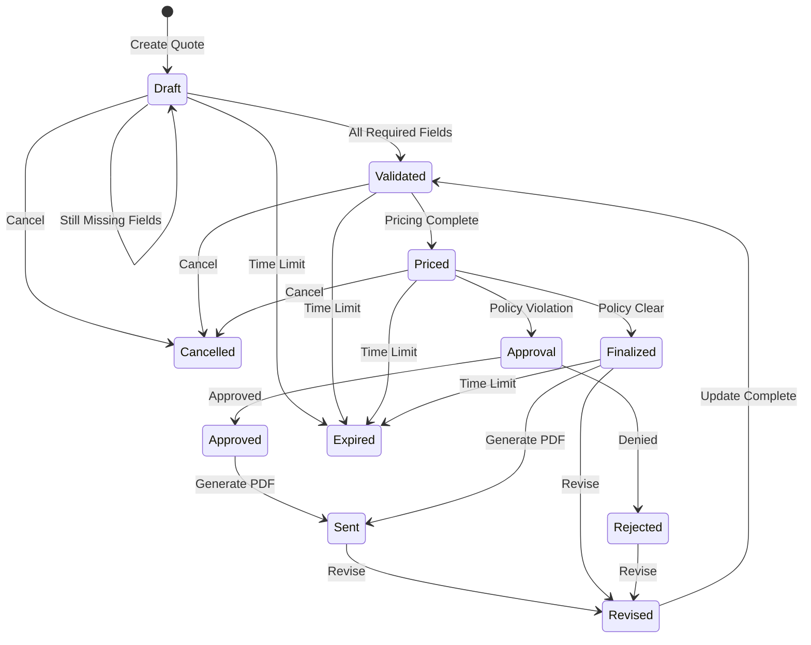

# Quote Lifecycle

Understanding the complete lifecycle of a quote in Quotey.

## Overview

A quote progresses through a series of states from creation to completion (or cancellation). Each state transition is validated and auditable.

## State Diagram



## State Descriptions

### Draft

The initial state. Quote exists but may be incomplete.

**Characteristics:**
- Basic info captured (account, initial products)
- Required fields may be missing
- Not yet validated or priced
- Can be freely modified

**Exit conditions:**
- All required fields present → Validated
- Cancelled → Cancelled

### Validated

All required fields are present and configuration is valid.

**Characteristics:**
- Constraint checks passed
- Ready for pricing
- Still editable

**Exit conditions:**
- Pricing calculated → Priced
- Cancelled → Cancelled

### Priced

Pricing has been calculated.

**Characteristics:**
- Pricing trace generated
- Policy evaluation pending
- Totals are known

**Exit conditions:**
- Policy clear → Finalized
- Policy violation → Approval
- Cancelled → Cancelled

### Approval

Awaiting human approval due to policy violations.

**Characteristics:**
- One or more policy violations
- Approval request created
- Cannot proceed without approval

**Exit conditions:**
- Approved → Approved
- Denied → Rejected

### Approved

Approval has been granted.

**Characteristics:**
- Authorized to proceed
- May have conditions attached
- Ready to finalize

**Exit conditions:**
- PDF generated → Sent

### Finalized

Quote is complete and ready to send.

**Characteristics:**
- All approvals obtained (if needed)
- Pricing locked
- Ready for document generation

**Exit conditions:**
- PDF generated → Sent
- Revision requested → Revised

### Sent

PDF has been generated and delivered.

**Characteristics:**
- Document delivered to customer
- Quote is locked
- Can be revised to create new version

**Exit conditions:**
- Revision requested → Revised
- Expires → Expired

### Revised

A new version of the quote is being created.

**Characteristics:**
- Based on previous version
- Maintains version history
- Goes through full validation again

**Exit conditions:**
- Updates complete → Validated

### Expired

Quote validity period has ended.

**Characteristics:**
- No longer valid for acceptance
- Historical record only
- Can be cloned to create new quote

### Cancelled

Quote was manually cancelled.

**Characteristics:**
- Intentionally abandoned
- Reason recorded
- Historical record only

### Rejected

Approval was denied.

**Characteristics:**
- Cannot proceed as-is
- Can be revised and resubmitted
- Reason recorded

## Lifecycle Hooks

Actions triggered on state transitions:

| Transition | Actions |
|------------|---------|
| Draft → Validated | Evaluate pricing |
| Validated → Priced | Evaluate policy, generate pricing trace |
| Priced → Finalized | Generate configuration fingerprint, create delivery artifacts |
| Priced → Approval | Create approval request, notify approvers |
| Approval → Approved | Record approval, update audit log |
| Approved/Finalized → Sent | Generate PDF, deliver to customer |
| Any → Revised | Create new version, copy data |

## Versioning

When a quote is revised, a new version is created:

```
Q-2026-0042 v1 → Q-2026-0042 v2 → Q-2026-0042 v3
```

Each version:
- Has its own pricing snapshot
- Preserves history
- Links to parent version

## Timeline Example

```
T+0 min:    Quote created → Draft
T+2 min:    User adds line items
T+5 min:    All fields collected → Validated
T+6 min:    Pricing calculated → Priced
T+6 min:    Policy violation detected → Approval
T+1 hour:   Manager approves → Approved
T+1 hour:   PDF generated → Sent
T+3 days:   Customer requests changes
T+3 days:   Revision created → Revised
T+4 days:   Updates complete → Validated
T+4 days:   Re-priced → Priced
T+4 days:   Policy clear → Finalized
T+4 days:   New PDF → Sent (v2)
```

## See Also

- [Flow Engine](./flow-engine) — State machine implementation
- [CPQ Engine](./cpq-engine) — Pricing and validation
- [Audit Trail](./audit-trail) — Tracking all changes
