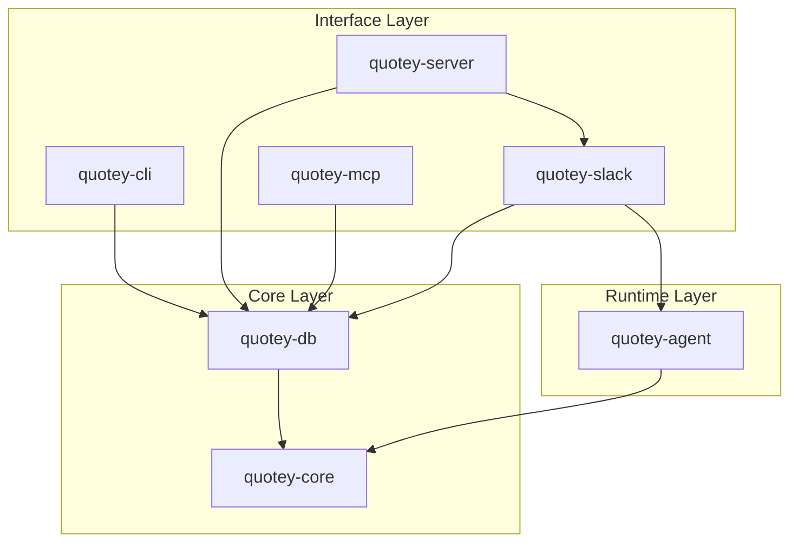

# Crate Overview

Quotey is organized as a Rust workspace with seven crates, each with clear responsibilities and dependency boundaries.

## Workspace Structure

```
quotey/
├── Cargo.toml           # Workspace definition
└── crates/
    ├── core/            # Business logic, domain models
    ├── db/              # Database layer
    ├── agent/           # LLM runtime, guardrails
    ├── slack/           # Slack integration
    ├── mcp/             # MCP server for AI agents
    ├── cli/             # Command-line interface
    └── server/          # Server bootstrap
```

## Dependency Graph



### Dependency Rules

1. **`core` has no dependencies** — Pure business logic with no I/O
2. **`db` depends only on `core`** — For domain types
3. **`agent` depends on `core`** — Never directly on `db`
4. **Interface crates are adapters** — They depend on `agent` and `core`
5. **`server` composes everything** — It's the wiring layer

## Crate Details

### quotey-core

**Purpose:** Core business logic, deterministic engines, domain models

**Location:** `crates/core/`

**Contains:**
- Domain entities (quote, product, customer, approval)
- CPQ engines (pricing, constraints, policy)
- Flow state machine
- Execution engine
- Audit, ledger, explanations
- Advanced features (DNA, autopsy, optimizer)

**Public API:**
```rust
// Domain types
pub use domain::quote::{Quote, QuoteLine, QuoteId, QuoteStatus};
pub use domain::product::{Product, ProductId};
pub use domain::customer::Customer;
pub use domain::approval::{ApprovalRequest, ApprovalStatus};

// CPQ engines
pub use cpq::{CpqRuntime, DeterministicCpqRuntime};
pub use cpq::constraints::{ConstraintEngine, ConstraintResult};
pub use cpq::pricing::{PricingEngine, PricingResult};
pub use cpq::policy::{PolicyEngine, PolicyEvaluation};

// Flow engine
pub use flows::{FlowEngine, FlowDefinition, FlowState, FlowEvent};

// Audit
pub use audit::{AuditEvent, AuditSink, AuditCategory};

// Errors
pub use errors::{DomainError, ApplicationError, InterfaceError};
```

**Key Design Principles:**
- No async code (pure logic)
- No external dependencies (database, HTTP, etc.)
- All operations are deterministic
- Comprehensive error types

**Example Usage:**
```rust
use quotey_core::cpq::{CpqRuntime, DeterministicCpqRuntime};
use quotey_core::flows::{FlowEngine, NetNewFlow};

// Create engines
let cpq = DeterministicCpqRuntime::default();
let flow = FlowEngine::new(NetNewFlow);

// Evaluate a quote
let evaluation = cpq.evaluate_quote(input).await;

// Apply a flow transition
let outcome = flow.apply(&current_state, &event, &context)?;
```

### quotey-db

**Purpose:** SQLite persistence layer

**Location:** `crates/db/`

**Contains:**
- Database connection management
- SQLx migrations
- Repository implementations
- Test fixtures

**Public API:**
```rust
// Connection
pub use connection::{connect, connect_with_settings, DbPool};

// Migrations
pub use migrations::run_migrations;

// Repositories
pub use repositories::{
    QuoteRepository, ProductRepository, CustomerRepository,
    ApprovalRepository, AuditRepository, // ... etc
};

// Fixtures
pub use fixtures::{E2ESeedDataset, SeedResult};
```

**Repository Pattern:**

Each entity has a repository trait and SQLite implementation:

```rust
// Trait defines the contract
#[async_trait]
pub trait QuoteRepository: Send + Sync {
    async fn create(&self, quote: &Quote) -> Result<Quote>;
    async fn get(&self, id: &QuoteId) -> Result<Option<Quote>>;
    async fn update(&self, quote: &Quote) -> Result<Quote>;
    async fn list_by_account(&self, account_id: &AccountId) -> Result<Vec<Quote>>;
}

// Implementation for SQLite
pub struct SqliteQuoteRepository {
    pool: DbPool,
}

#[async_trait]
impl QuoteRepository for SqliteQuoteRepository {
    async fn create(&self, quote: &Quote) -> Result<Quote> {
        sqlx::query_as::<_, Quote>(
            "INSERT INTO quote (id, account_id, ...) VALUES (?, ?, ...)"
        )
        .bind(&quote.id.0)
        .bind(quote.account_id.as_ref().map(|a| &a.0))
        // ...
        .fetch_one(&self.pool)
        .await
        .map_err(Into::into)
    }
}
```

**Key Design Principles:**
- Repository pattern for testability
- SQLx for compile-time query checking
- Connection pooling with SQLx Pool
- WAL mode for concurrent access

### quotey-agent

**Purpose:** LLM-powered intent extraction and orchestration

**Location:** `crates/agent/`

**Contains:**
- Agent runtime (main orchestrator)
- Guardrails (safety policies)
- Conversation context management
- LLM provider abstraction
- Tool registry and execution

**Public API:**
```rust
// Runtime
pub use runtime::AgentRuntime;

// Guardrails
pub use guardrails::{GuardrailPolicy, GuardrailDecision, GuardrailIntent};

// LLM
pub use llm::LlmClient;

// Tools
pub use tools::ToolRegistry;
```

**Agent Runtime:**

```rust
pub struct AgentRuntime {
    llm: Arc<dyn LlmClient>,
    guardrails: GuardrailPolicy,
    tools: ToolRegistry,
    cpq: Arc<dyn CpqRuntime>,
}

impl AgentRuntime {
    pub async fn process_message(
        &self,
        context: ConversationContext,
        message: &str,
    ) -> Result<AgentResponse> {
        // 1. Extract intent
        let intent = self.extract_intent(message).await?;
        
        // 2. Check guardrails
        let guardrail_intent = self.classify_for_guardrails(&intent);
        match self.guardrails.evaluate(&guardrail_intent) {
            GuardrailDecision::Allow => {}
            GuardrailDecision::Deny { user_message, .. } => {
                return Ok(AgentResponse::text(user_message));
            }
            GuardrailDecision::Degrade { fallback_path, .. } => {
                return self.handle_degraded(fallback_path).await;
            }
        }
        
        // 3. Execute tools
        let result = self.tools.execute(&intent).await?;
        
        // 4. Generate response
        let response = self.generate_response(&result).await?;
        
        Ok(response)
    }
}
```

**Key Design Principles:**
- LLM is a translator, not a decider
- Guardrails prevent inappropriate actions
- Tools provide clean boundaries
- Conversation context maintains state

### quotey-slack

**Purpose:** Slack bot interface using Socket Mode

**Location:** `crates/slack/`

**Contains:**
- Socket Mode WebSocket handling
- Slash command handlers
- Event processing
- Block Kit UI builders

**Public API:**
```rust
// Socket mode
pub use socket::SocketModeRunner;

// Commands
pub use commands::handle_slash_command;

// Blocks (UI)
pub use blocks::{
    quote_created_message,
    quote_priced_message,
    approval_request_message,
};
```

**Socket Mode Runner:**

```rust
pub struct SocketModeRunner {
    client: SlackClient,
    event_handler: EventDispatcher,
}

impl SocketModeRunner {
    pub async fn run(&self) -> Result<()> {
        loop {
            // Connect to Slack WebSocket
            let ws = self.client.connect_socket_mode().await?;
            
            // Process events
            while let Some(event) = ws.next().await {
                match event {
                    Ok(event) => self.handle_event(event).await?,
                    Err(e) => {
                        tracing::error!("WebSocket error: {}", e);
                        break; // Reconnect
                    }
                }
            }
            
            // Exponential backoff before reconnect
            tokio::time::sleep(self.reconnect_delay).await;
        }
    }
}
```

**Key Design Principles:**
- Thin layer — no business logic
- Automatic reconnection
- Event dispatch to handlers
- Rich UI with Block Kit

### quotey-mcp

**Purpose:** MCP (Model Context Protocol) server for AI agent integration

**Location:** `crates/mcp/`

**Contains:**
- MCP protocol implementation
- Tool definitions and routing
- Authentication

**Public API:**
```rust
pub use server::QuoteyMcpServer;
pub use tools::ToolCategory;
```

**MCP Tools:**

The MCP server exposes these tools to AI agents:

| Tool | Description |
|------|-------------|
| `catalog_search` | Search products by query |
| `catalog_get` | Get product by ID |
| `quote_create` | Create a new quote |
| `quote_get` | Get quote by ID |
| `quote_price` | Calculate pricing for a quote |
| `quote_list` | List quotes with filters |
| `approval_request` | Request approval for a quote |
| `approval_status` | Check approval status |
| `quote_pdf` | Generate PDF for a quote |

### quotey-cli

**Purpose:** Operator command-line interface

**Location:** `crates/cli/`

**Contains:**
- CLI argument parsing
- Command implementations
- Diagnostics and troubleshooting

**Commands:**

| Command | Description |
|---------|-------------|
| `start` | Start the server |
| `migrate` | Run database migrations |
| `seed` | Load demo data |
| `smoke` | Run smoke tests |
| `config` | Show configuration |
| `doctor` | Diagnostics and troubleshooting |
| `policy-packet` | Build policy approval packets |
| `genome` | Revenue genome analysis |

**Example:**

```bash
# Run migrations
cargo run -p quotey-cli -- migrate

# Seed demo data
cargo run -p quotey-cli -- seed

# Check configuration
cargo run -p quotey-cli -- config

# Run diagnostics
cargo run -p quotey-cli -- doctor
```

### quotey-server

**Purpose:** Server application bootstrap

**Location:** `crates/server/`

**Contains:**
- Main entry point
- Application initialization
- Health check endpoint
- Component wiring

**Architecture:**

```rust
#[tokio::main]
async fn main() -> Result<()> {
    // 1. Load configuration
    let config = load_config()?;
    
    // 2. Initialize tracing
    init_tracing(&config.logging)?;
    
    // 3. Connect to database
    let db_pool = quotey_db::connect(&config.database.url).await?;
    
    // 4. Run migrations
    quotey_db::run_migrations(&db_pool).await?;
    
    // 5. Create CPQ runtime
    let cpq = DeterministicCpqRuntime::new(/* ... */);
    
    // 6. Create agent runtime
    let agent = AgentRuntime::new(/* ... */);
    
    // 7. Start Slack runner
    let slack = SocketModeRunner::new(agent, config.slack);
    tokio::spawn(slack.run());
    
    // 8. Start health check server
    let health = HealthServer::new(config.server);
    health.run().await?;
    
    Ok(())
}
```

## Adding Code to Crates

### New Feature in Core

```rust
// crates/core/src/domain/my_feature.rs
pub struct MyFeature {
    // ...
}

// Add to crates/core/src/domain/mod.rs
pub mod my_feature;
pub use my_feature::MyFeature;

// Add to crates/core/src/lib.rs
pub use domain::MyFeature;
```

### New MCP Tool

Add to `crates/mcp/src/server.rs`:

```rust
#[tool]
async fn my_new_tool(
    &self,
    input: MyToolInput,
) -> Result<MyToolOutput, ToolError> {
    // Implementation
}
```

### New Slack Command

Add to `crates/slack/src/commands.rs`:

```rust
async fn handle_my_command(
    command: &SlackSlashCommand,
    agent: &AgentRuntime,
) -> Result<SlackMessage> {
    // Implementation
}
```

### New CLI Command

1. Add subcommand to `crates/cli/src/lib.rs`:
```rust
#[derive(Subcommand)]
pub enum Commands {
    // ... existing commands
    MyCommand(MyCommandArgs),
}
```

2. Implement in `crates/cli/src/commands/my_command.rs`

3. Add to command router in `crates/cli/src/commands/mod.rs`

## Testing Across Crates

### Unit Tests (in-crate)

```rust
// crates/core/src/something.rs
#[cfg(test)]
mod tests {
    use super::*;
    
    #[test]
    fn test_something() {
        // Test pure logic
    }
}
```

### Integration Tests (separate test crate or tests/ folder)

```rust
// crates/slack/tests/integration.rs
use quotey_slack::*;
use quotey_core::*;
use quotey_db::*;

#[tokio::test]
async fn test_slack_flow() {
    // Integration test across crates
}
```

### Test Dependencies

Use mock implementations for isolation:

```rust
// Mock LLM client
pub struct MockLlm {
    responses: Vec<String>,
}

#[async_trait]
impl LlmClient for MockLlm {
    async fn complete(&self, _prompt: &str) -> Result<String> {
        Ok(self.responses.pop().unwrap())
    }
}
```

## Next Steps

- [Core Crate](./core) — Deep dive into quotey-core
- [Database Crate](./db) — Repository patterns and migrations
- [Agent Crate](./agent) — LLM integration and guardrails
