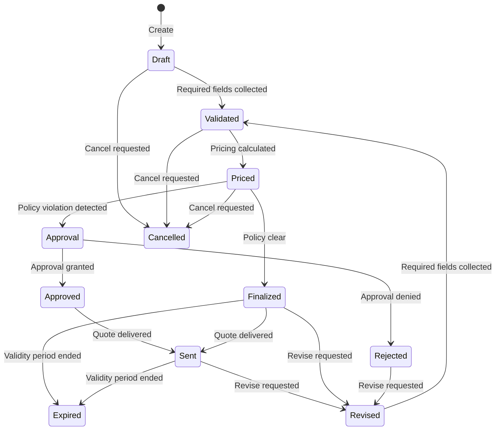

# Key Concepts

Understanding these core concepts is essential for working effectively with Quotey.

## The Safety Principle

This is the most important architectural decision in the entire system.

**The LLM is strictly a translator.** It converts:
- Natural language → structured intent (slot extraction)
- Fuzzy product names → product IDs (catalog matching)
- Structured data → human-friendly summaries
- Deal context → approval justification text

**The LLM NEVER becomes the source of truth for:**
- ❌ Prices (deterministic pricing engine decides)
- ❌ Configuration validity (constraint engine decides)
- ❌ Policy compliance (rules engine decides)
- ❌ Approval routing (threshold matrix decides)
- ❌ Discount authorization (approval workflow decides)

This separation is not a limitation — it's the feature. Enterprise CPQ requires deterministic, auditable pricing. An LLM hallucinating a price is a contractual liability. The strict separation eliminates this risk class entirely while still getting the benefits of natural language interaction.

## Agent-First vs. Traditional CPQ

| Aspect | Traditional CPQ | Quotey (Agent-First) |
|--------|----------------|---------------------|
| **Interaction** | Click through rigid UI screens | Natural language in Slack |
| **Data Input** | Structured forms | Extract from unstructured text |
| **Pricing** | Hidden in code/configuration | Deterministic, explainable, auditable |
| **Training** | Weeks of training required | Reps already know Slack |
| **Catalog Setup** | Months of data cleansing | Bootstrap from messy sources |
| **Approvals** | Email chains, manual routing | Context-aware, pre-packaged requests |

## Determinism

Quotey's core operations are **deterministic**: given the same inputs, they always produce the same outputs. This is critical for:

1. **Auditability** — You can prove how any price was calculated
2. **Reproducibility** — Bugs can be reproduced and fixed
3. **Trust** — Users know the system won't arbitrarily change behavior
4. **Testing** — Outputs can be snapshotted and compared

Deterministic components:
- Constraint engine
- Pricing engine  
- Policy engine
- Flow state machine

Non-deterministic components (by design):
- LLM intent extraction (falls back to deterministic patterns)
- Product name matching (suggests, doesn't decide)

## Quote Lifecycle

Every quote moves through a well-defined state machine:



### State Descriptions

| State | Description |
|-------|-------------|
| **Draft** | Initial state. Quote has basic info but may be incomplete. |
| **Validated** | All required fields present. Configuration is valid. |
| **Priced** | Pricing has been calculated. Policy evaluation pending. |
| **Approval** | Policy violations require human approval. |
| **Approved** | Approval granted. Ready to finalize. |
| **Finalized** | Quote is complete and ready to send. |
| **Sent** | PDF generated and delivered to customer. |
| **Revised** | A new version of the quote is being created. |
| **Expired** | Quote validity period has ended. |
| **Cancelled** | Quote was manually cancelled. |
| **Rejected** | Approval was denied. |

## Constraint-Based Configuration

Quotey uses **constraint-based** rather than **rules-based** configuration. This is a critical architectural choice.

### Rules-Based (Traditional)

```
If customer selects Option A, then Option B is required
If customer selects Option A, then Option C is excluded
If customer selects Option B and Option D, then Option E is required
...
```

For N options, you need O(N²) rules. This leads to combinatorial explosion.

### Constraint-Based (Quotey)

```
Motor voltage must match enclosure voltage rating
Enclosure thermal rating must exceed motor heat output
Bundle must contain exactly 1 base plan + 1 support tier
```

A few constraints replace hundreds of rules. This scales better and is easier to maintain.

### Constraint Types

| Type | Example |
|------|---------|
| **Requires** | Product A requires Product B |
| **Excludes** | Product A is incompatible with Product B |
| **Attribute** | Attribute values must satisfy conditions |
| **Quantity** | Minimum/maximum quantities |
| **Bundle** | Bundle composition rules |
| **Cross-product** | Constraints spanning multiple line items |

## The Pricing Trace

Every pricing calculation produces a **pricing trace** — a complete audit trail showing exactly how the price was calculated.

```json
{
  "quote_id": "Q-2026-0042",
  "priced_at": "2026-02-23T14:30:00Z",
  "price_book_id": "pb_enterprise_us",
  "lines": [
    {
      "line_id": "ql_001",
      "product_id": "plan_pro_v2",
      "base_unit_price": 10.00,
      "volume_tier_applied": {
        "tier": "100+",
        "tier_unit_price": 8.00
      },
      "formula_applied": {
        "formula_id": "f_annual_commitment",
        "expression": "unit_price * quantity * (term_months / 12)",
        "result": 14400.00
      },
      "discount_applied": {
        "requested": 10.0,
        "authorized": 10.0,
        "policy_check": "PASS (10% <= 15% segment cap)"
      }
    }
  ],
  "total": 12960.00
}
```

This trace is stored immutably. If the quote is re-priced, a new snapshot is created (the old one is retained for audit history).

## Local-First Architecture

Quotey is designed to work entirely locally:

- **SQLite database** — No external database server needed
- **Slack Socket Mode** — No public URL or cloud deployment required
- **Ollama support** — Local LLM inference, no API keys needed
- **Single binary** — Easy deployment and distribution

Benefits:
- ✅ Works offline
- ✅ No cloud vendor lock-in
- ✅ Data stays on-premise
- ✅ Fast local performance
- ✅ Easy backup (just copy the SQLite file)

Trade-offs:
- Single-node (no horizontal scaling)
- Manual backup responsibility
- Self-managed updates

## Flow Types

Quotey supports different quote workflows:

### Net-New Quote

The standard flow for new customers:
1. Identify customer
2. Gather deal context
3. Build line items
4. Validate configuration
5. Run pricing
6. Policy checks
7. Approval if needed
8. Generate PDF

### Renewal Expansion

For existing customers renewing and/or expanding:
1. Load existing contract context
2. Identify changes (added seats, new products)
3. Apply renewal-specific pricing
4. Validate against existing contract
5. Renewal-specific policy checks

### Discount Exception

For requesting discounts beyond standard policy:
1. Load existing quote
2. Evaluate against discount policy matrix
3. Determine required approval level(s)
4. Route through approval chain
5. Update pricing if approved

## Guardrails

Guardrails are safety policies that prevent the agent from taking inappropriate actions:

```rust
pub enum GuardrailDecision {
    Allow,              // Proceed with the action
    Deny {              // Block the action entirely
        reason_code: &'static str,
        user_message: String,
        fallback_path: &'static str,
    },
    Degrade {           // Allow a reduced version
        reason_code: &'static str,
        user_message: String,
        fallback_path: &'static str,
    },
}
```

Examples:
- ❌ **Deny**: LLM attempting to set a price directly
- ❌ **Deny**: LLM attempting to approve a discount
- ✅ **Allow**: Queue actions when enabled
- ⚠️ **Degrade**: Ambiguous intent → request explicit action

## Audit Trail

Every action in Quotey is logged to an immutable audit trail:

| Event Category | Example Events |
|----------------|---------------|
| **Quote** | created, updated, versioned, finalized, sent |
| **Pricing** | calculated, recalculated |
| **Approval** | requested, approved, rejected, escalated |
| **Configuration** | validated, constraint_violation |
| **Agent** | intent_extracted, action_selected, llm_called |
| **System** | started, migration_run, error |

Each audit event includes:
- Timestamp
- Actor (user ID, system component)
- Quote ID (if applicable)
- Event type and category
- Full payload (structured JSON)
- Correlation ID for tracing

## Next Steps

- [Architecture Overview](../architecture/overview) — See how these concepts fit together
- [CPQ Engine](../core-concepts/cpq-engine) — Deep dive into configuration, pricing, and policy
- [Flow Engine](../core-concepts/flow-engine) — Understand the state machine
